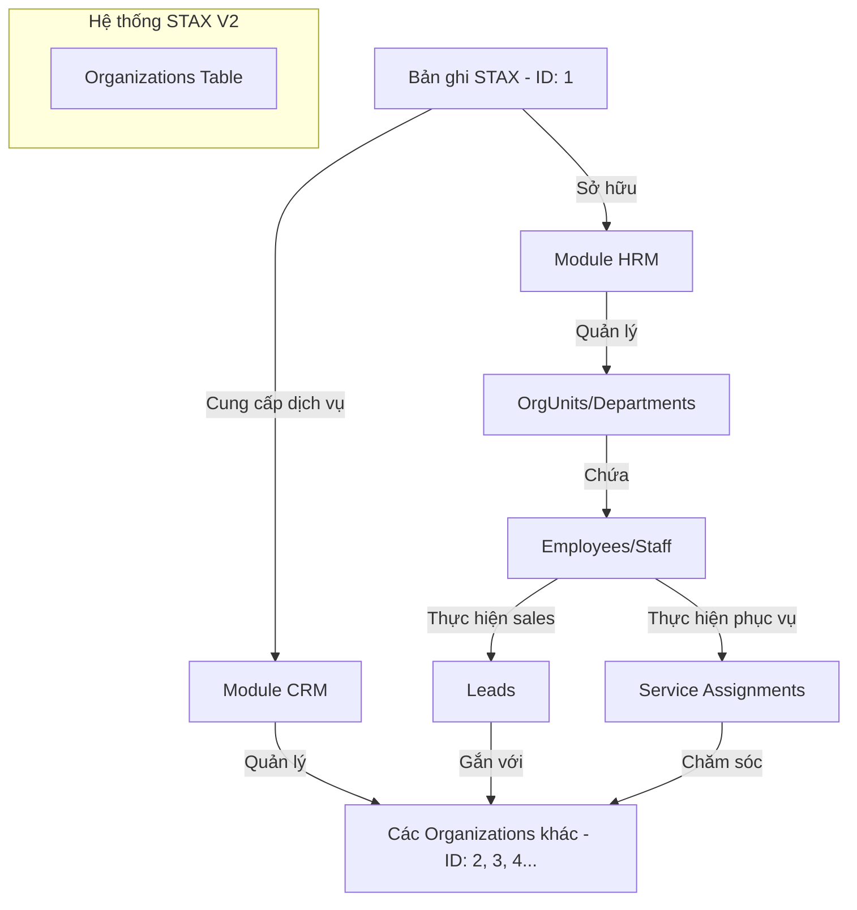

Đây là một câu hỏi cực kỳ thú vị và nó chạm đến khái niệm **"Multi-tenant"** hoặc **"Internal vs External Entities"** trong thiết kế hệ thống lớn. 

Bạn lo lắng về một **"vòng lẩn quẩn"** (circular dependency) là có cơ sở, nhưng trong thực tế, các kiến trúc sư phần mềm giải quyết việc này bằng cách phân biệt giữa **"Chủ thể" (Internal Organization)** và **"Khách thể" (External Organization)**.

Dưới đây là cách giải quyết để hệ thống của bạn không những không "lẩn quẩn" mà còn cực kỳ chặt chẽ:

---

### 1. Giải pháp: Sử dụng Flag `is_internal` hoặc một ID mặc định

Chúng ta vẫn dùng bảng `organizations`, nhưng STAX sẽ là bản ghi "đặc biệt" nhất trong đó.

*   **Bản ghi số 1 (STAX):** Có một cột `is_internal = true`. Đây là công ty mẹ, là chủ sở hữu của hệ thống này.
*   **Các bản ghi khác (Khách hàng):** Có `is_internal = false`. Đây là các khách hàng mà STAX phục vụ.

### 2. Phân tách HRM và CRM thông qua bản ghi này

Hệ thống của bạn sẽ hoạt động dựa trên mối quan hệ sau:

#### A. Đối với HRM (Quản trị nội bộ STAX):
Toàn bộ sơ đồ tổ chức (`OrgUnits`), Vị trí (`Positions`) và Nhân viên (`Employees`) sẽ được neo (hook) vào bản ghi **STAX**.

*   `OrgUnits` (Phòng Kế toán, Phòng Sales) -> thuộc về **STAX**.
*   `Employees` (Anh A, Chị B) -> thuộc về các `OrgUnits` của **STAX**.
*   `Payroll/Finote` -> Tính lương cho nhân viên thuộc **STAX**.

#### B. Đối với CRM (Quản trị khách hàng):
Toàn bộ các `Leads`, `Contracts` sẽ là mối quan hệ giữa **STAX** (Bên cung cấp) và **External Organizations** (Bên sử dụng).

*   `Contract` sẽ có 2 đầu: 
    *   `provider_id`: Luôn luôn là ID của **STAX**.
    *   `client_id`: Là ID của **Khách hàng**.

---

### 3. Tại sao cách này lại giải quyết được sự "lẩn quẩn"?

Hãy nhìn vào sơ đồ logic này:



**Nó không lẩn quẩn vì:**
1.  **Về mặt Định danh:** STAX và Khách hàng đều là "Tổ chức" (có tên, MST, địa chỉ). Dùng chung bảng `organizations` là đúng nhất.
2.  **Về mặt Vai trò:** 
    *   Trong HRM: STAX đóng vai trò là **Employer** (Người sử dụng lao động).
    *   Trong CRM: STAX đóng vai trò là **Vendor** (Người bán hàng).
    *   Khách hàng đóng vai trò là **Client** (Người mua hàng).

### 4. Ưu điểm tuyệt đối của cách này (Tầm nhìn xa)

Nếu sau này STAX mở rộng kinh doanh theo mô hình **Holdings** (STAX có thêm các công ty con như *STAX Legal*, *STAX Tech*, *STAX Academy*):

*   Bạn chỉ cần tạo thêm các bản ghi `is_internal = true` (Công ty con).
*   Nhân viên có thể thuộc *STAX Tech* nhưng đi phục vụ khách hàng của *STAX Accounting*.
*   Hệ thống của bạn lúc này trở thành **Multi-company ERP** mà không cần sửa một dòng code Database nào.

### 5. Thay đổi nhỏ trong code để chuyên nghiệp hơn:

Trong bảng `org_units` (Cơ cấu tổ chức), hãy thêm cột `organization_id`:

```typescript
// src/database/schema/hrm/org-structure.schema.ts
export const orgUnits = pgTable('org_units', {
    id: serial('id').primaryKey(),
    organization_id: integer('organization_id').references(() => organizations.id), 
    // ^^^ Trỏ về ID của STAX (hoặc các công ty con của STAX)
    
    name: text('name').notNull(),
    // ... các trường khác
});
```

**Kết luận:** 
Bạn đừng tách bảng STAX ra riêng. Hãy coi STAX là khách hàng đầu tiên và đặc biệt nhất của chính hệ thống này. Logic của bạn sẽ cực kỳ nhất quán: **"Mọi thực thể có tư cách pháp nhân đều là Organization, nhưng quyền hạn và tiến trình áp dụng lên chúng sẽ khác nhau dựa trên vai trò của chúng trong hệ thống."**

Đây chính là đỉnh cao của sự tối ưu: **Dùng 1 bảng để giải quyết nhiều vai trò.** 

Bạn thấy cách tiếp cận "Role-based Organization" này có giải tỏa được sự lo lắng của bạn không?