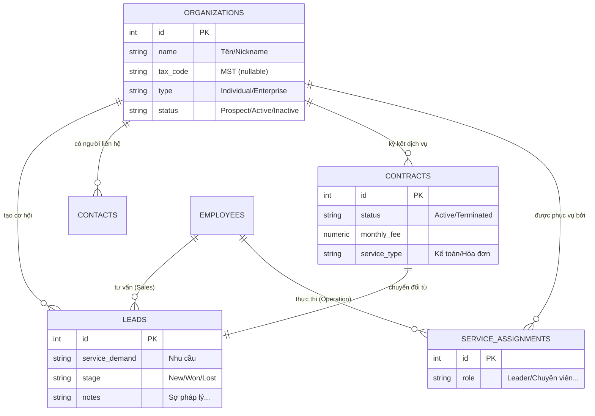
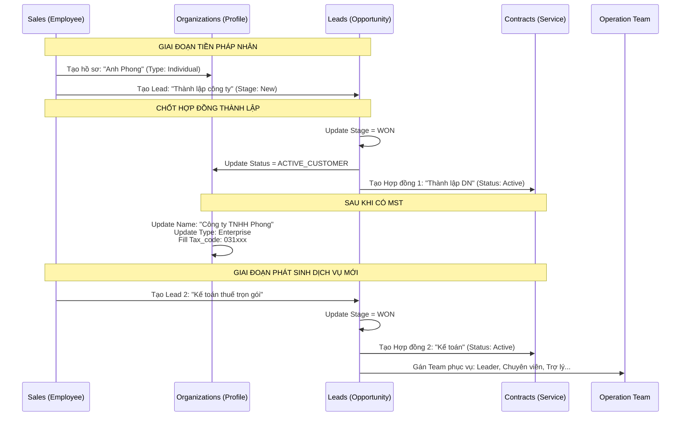
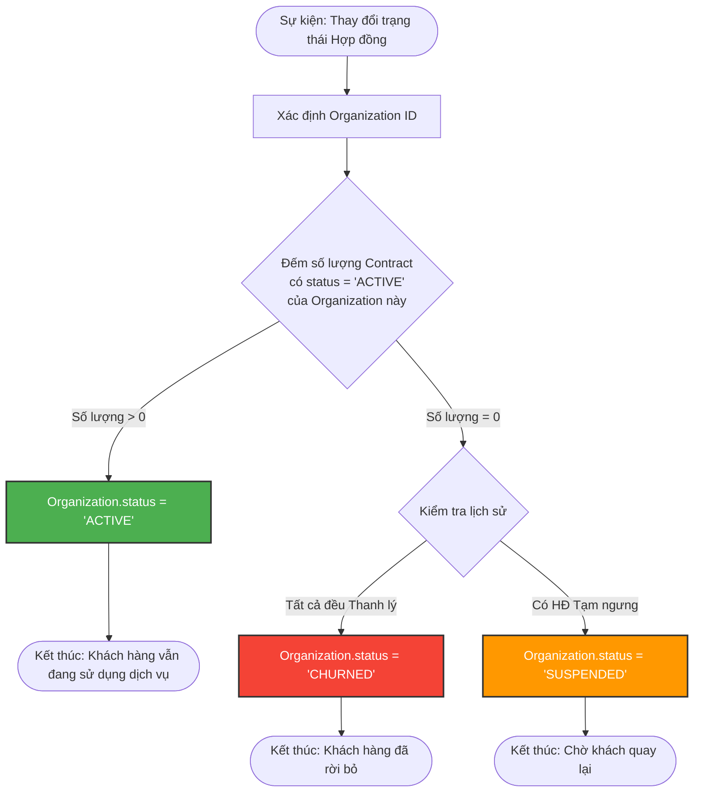

Dưới đây là sơ đồ hóa toàn bộ quy trình vận hành từ lúc khách hàng là một cá nhân (Lead) cho đến khi trở thành Doanh nghiệp có nhiều hợp đồng và đội ngũ phục vụ chuyên nghiệp.

---

### 1. Sơ đồ Quan hệ Thực thể (ERD - Logic trung tâm)
Sơ đồ này thể hiện bảng `Organizations` là "trái tim" của hệ thống, kết nối mọi thông tin xuyên suốt vòng đời khách hàng.

---

### 2. Quy trình Tiến hóa: Từ Cá nhân (Lead) sang Doanh nghiệp (Client)
Sơ đồ này mô tả cách hệ thống xử lý tình huống "Anh Phong" chưa có công ty, sau đó chốt hợp đồng và trở thành doanh nghiệp chính thức.

---

### 3. Logic xử lý Trạng thái (Multi-Contract Status)
Sơ đồ này giải thích câu hỏi của bạn: "Nếu làm 2 hợp đồng, ngưng 1 thì Global Status của khách hàng sẽ ra sao?".

---

### Sự "Hoàn hảo" ở đây nằm ở 3 điểm:

1.  **Dữ liệu không bao giờ bị ngắt quãng:** Bạn thấy toàn bộ hành trình từ lúc "Anh Phong" còn sợ pháp lý cho đến khi "Công ty TNHH Phong" có 5 hợp đồng. Không có dữ liệu nào bị xóa hay copy sang bảng khác.
2.  **Quản lý Ma trận Phục vụ (6 người):** Bảng `Service_Assignments` cho phép bạn quản lý cực kỳ linh hoạt. Nếu Chuyên viên B2 nghỉ việc, bạn chỉ cần Update 1 dòng trong bảng này, tất cả khách hàng của người đó sẽ được chuyển sang người mới mà không ảnh hưởng đến Hợp đồng hay Hồ sơ gốc.
3.  **Tối ưu báo cáo Tài chính:** Bạn có thể query ra: *"Trong tháng 6, STax thu bao nhiêu tiền từ các khách hàng có gốc từ nguồn Relationship?"* (Kết nối từ `Contracts` -> `Leads` -> `Organizations`). Đây là báo cáo mà các hệ thống tách bảng thông thường rất khó làm được.

Bạn có muốn tôi giúp bạn chuyển hóa các sơ đồ này thành **Mẫu Class (Service Layer)** trong NestJS để hiện thực hóa logic này không?