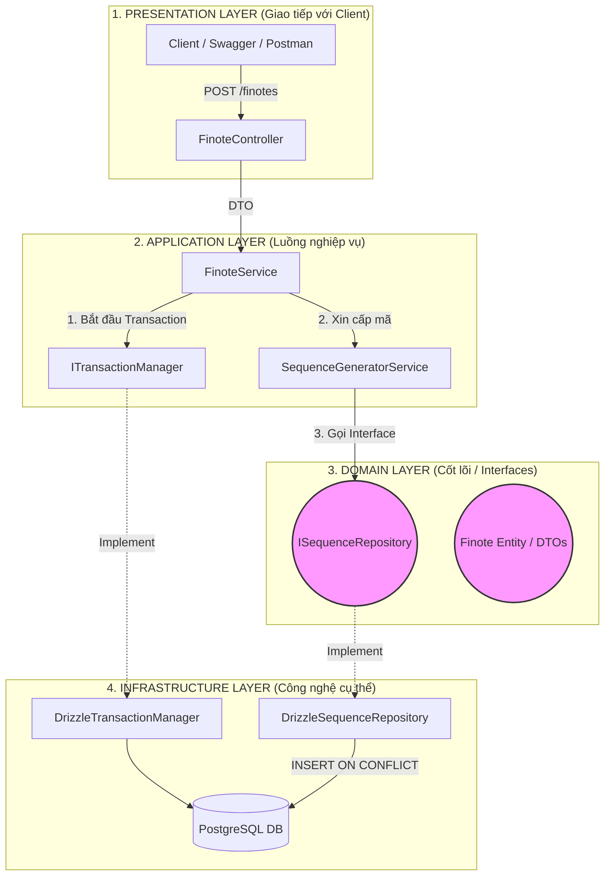
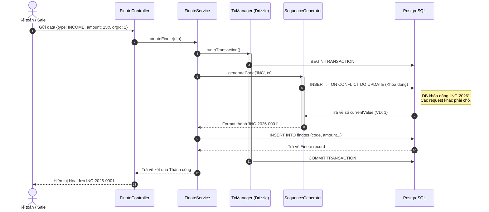
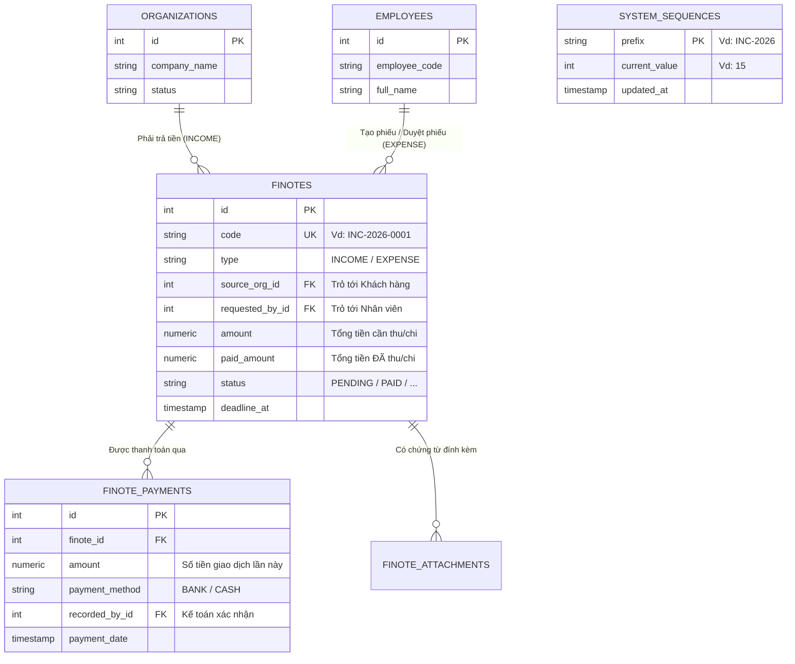

Việc dừng lại một nhịp để nhìn toàn cảnh (Big Picture) bằng sơ đồ là một thói quen cực kỳ tuyệt vời của các Software Architect. Nó giúp bạn không bị "lạc lối" khi code ngày càng phình to.

Hệ thống bạn đang xây dựng là sự giao thoa giữa **HRM (Nhân sự)**, **CRM (Khách hàng)** và **Accounting (Tài chính)**. 

Tôi đã chuẩn bị **3 Sơ đồ Mermaid** thể hiện 3 góc nhìn quan trọng nhất của hệ thống hiện tại. Bạn có thể copy các khối code dưới đây dán vào [Mermaid Live Editor](https://mermaid.live/) hoặc xem trực tiếp trên các Markdown Viewer hỗ trợ Mermaid.

---

### Sơ đồ 1: Góc nhìn Kiến trúc (Clean Architecture)
Sơ đồ này cho thấy cách các Layer (Tầng) giao tiếp với nhau. Quy tắc bất di bất dịch: **Tầng ngoài (Controller/Drizzle) gọi vào tầng trong (Service/Domain), không có chiều ngược lại.**

---

### Sơ đồ 2: Góc nhìn Luồng dữ liệu (Sequence Diagram)
Sơ đồ này mô tả chính xác những gì xảy ra bên dưới hàm `createFinote` mà chúng ta vừa viết. Nó giải thích cách chúng ta chống lỗi trùng mã (Race Condition).

---

### Sơ đồ 3: Góc nhìn Cơ sở dữ liệu (Entity Relationship - ERD)
Sơ đồ này thể hiện **Trái tim của hệ thống ERP**. Nó cho thấy bảng `finotes` (Nguyên tử tài chính) đứng ở giữa và liên kết toàn bộ công ty (Nhân sự) với thế giới bên ngoài (Khách hàng).

### Tóm tắt vị trí hiện tại của bạn:
1. Bạn đã có một **Nền tảng Database (ERD)** cực kỳ vững chắc để scale lên thành ERP.
2. Bạn đã dựng xong **Kiến trúc Clean (Architecture)** để tách biệt các lớp, code rất dễ bảo trì.
3. Bạn vừa hoàn thành **Luồng sinh mã an toàn (Sequence Workflow)** cho module Tài chính.

Nhìn vào các sơ đồ trên, bạn muốn chúng ta đắp "thịt" cho phần nào tiếp theo?
1. Viết `FinoteController` để test API tạo phiếu qua Postman.
2. Bắt đầu xử lý EventBus (Để khi tạo phiếu xong thì tự động sinh file PDF).
