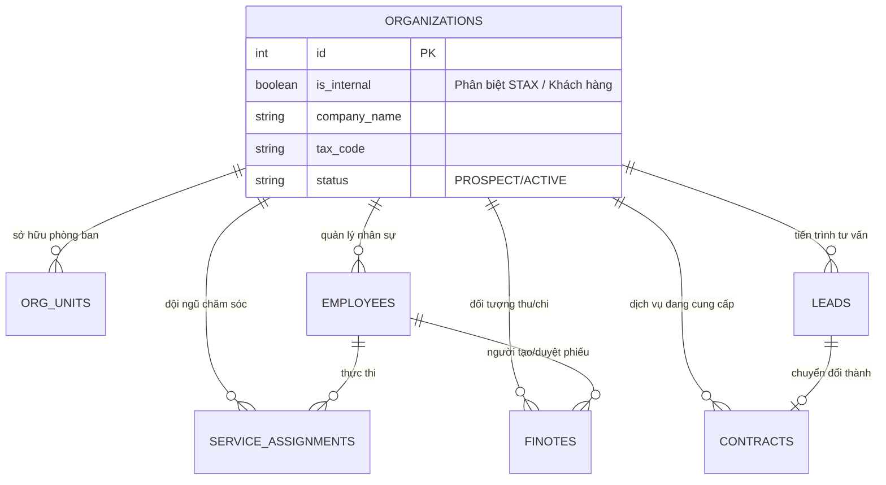
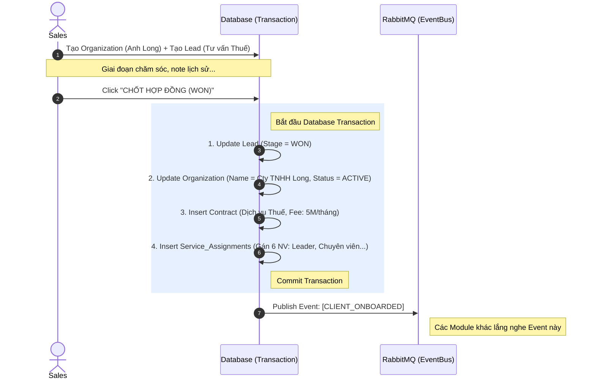
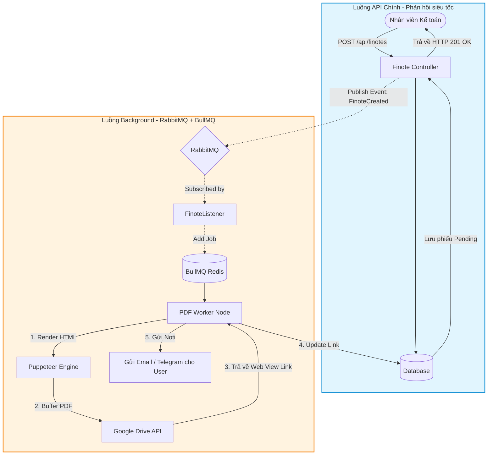
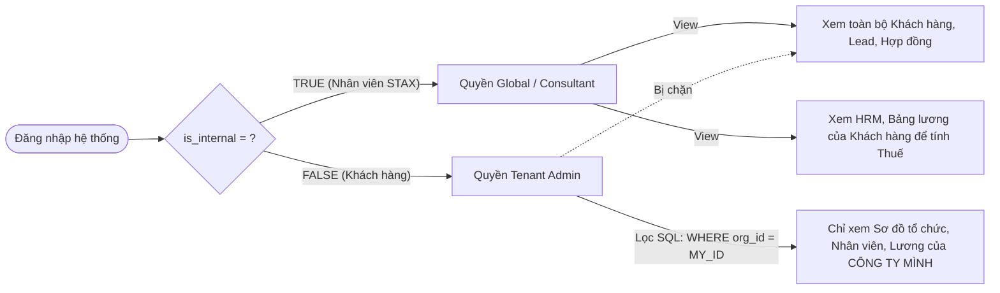

# 🏗️ TÀI LIỆU KIẾN TRÚC HỆ THỐNG ERP/HRM/CRM (STAX ENTERPRISE)

## 1. TRIẾT LÝ THIẾT KẾ CỐT LÕI (CORE PHILOSOPHY)

Hệ thống được thiết kế dựa trên 4 trụ cột kiến trúc:
1.  **Single Source of Truth (Nguồn sự thật duy nhất):** Bảng `Organizations` là trung tâm của vũ trụ. Dù là Khách hàng, Nhà cung cấp, hay chính bản thân công ty chủ quản (STAX), tất cả đều nằm ở đây.
2.  **Entity-Process Separation (Tách biệt Thực thể & Tiến trình):** Không dùng bảng riêng cho "Lead" hay "Client". `Organization` là Thực thể (DNA). `Leads`, `Contracts`, `Finotes` là Tiến trình (Hành động).
3.  **Multi-Tenancy Ready (Sẵn sàng Đa người dùng):** Sử dụng cờ `is_internal` để phân biệt công ty mẹ (STAX) và khách hàng. Mọi bảng HRM (`org_units`, `employees`) đều gắn `organization_id`.
4.  **Event-Driven & Async Processing:** API phản hồi siêu tốc. Các tác vụ nặng (Sinh PDF, Upload Drive, Bắn Email) được đẩy xuống Background Workers thông qua **RabbitMQ** và **BullMQ**.

---

## 2. SƠ ĐỒ THỰC THỂ TOÀN CỤC (GLOBAL ERD)

Sơ đồ này cho thấy cách 3 Module (CRM, HRM, Accounting) xoay quanh thực thể gốc là `ORGANIZATIONS`.

---

## 3. CÁC LUỒNG NGHIỆP VỤ CỐT LÕI (WORKFLOWS)

### Luồng 1: Vòng đời Khách hàng (CRM: Từ Lead đến Active Client)
**Mục tiêu:** Chuyển đổi một cá nhân/tiềm năng thành một Doanh nghiệp có hợp đồng, không làm đứt gãy dữ liệu lịch sử, đồng thời gán đội ngũ phục vụ.

---

### Luồng 2: Kế toán Tài chính (Accounting: Sinh PDF & Lưu trữ Bất đồng bộ)
**Mục tiêu:** Kế toán tạo Phiếu Thu (Finote) để thu tiền Hợp đồng. Hệ thống phản hồi ngay lập tức, việc sinh file PDF (bằng Puppeteer) và upload lên Google Drive được chạy ngầm bởi BullMQ.

---

### Luồng 3: Quản trị Đa mô hình (Multi-tenant HRM Access)
**Mục tiêu:** Hệ thống giải quyết bài toán: Nhân viên STAX thấy gì? Và Khách hàng thấy gì khi đăng nhập vào hệ thống HRM?

---

## 4. CHIẾN LƯỢC CƠ SỞ HẠ TẦNG & GIAO TIẾP (MESSAGING STRATEGY)

Dự án này sử dụng mô hình kết hợp (Hybrid) để đạt ngưỡng Enterprise:

| Công cụ | Vai trò trong hệ thống STAX | Ví dụ nghiệp vụ áp dụng |
| :--- | :--- | :--- |
| **Drizzle ORM + Postgres** | Lưu trữ cốt lõi, ACID Transaction | Lưu Hợp đồng, Khách hàng, Cây sơ đồ tổ chức (Materialized Path). |
| **Redis** | Caching, Rate Limiting, Session | Lưu AccessToken, Cache quyền RBAC (TTL 300s), OTP. |
| **RabbitMQ** | Message Broker (Giao tiếp module) | Nhận sự kiện `CLIENT_ONBOARDED`, báo cho module Accounting tự động tạo Phiếu Thu kỳ 1. |
| **BullMQ (Redis)** | Task Queue (Làm việc nặng) | Mở Chromium ẩn để vẽ PDF, Upload file lên Google Drive, Gửi 1000 email lương cuối tháng. |

---

## 5. KẾ HOẠCH HÀNH ĐỘNG TIẾP THEO (NEXT ACTIONS)

Dựa trên bản thiết kế này, bạn cần thực hiện các bước code sau theo thứ tự:

1.  **Database Migration (Core):**
    *   Bổ sung cột `is_internal` vào bảng `organizations`.
    *   Bổ sung cột `organization_id` vào các bảng `org_units`, `employees`, `finotes`...
    *   Tạo bảng mới `service_assignments` để lưu đội ngũ 6 người phục vụ.
2.  **Refactor Workflow Service:**
    *   Cập nhật `LeadService` -> Thêm hàm `closeLeadAsWon` dùng `runInTransaction` như đã thống nhất ở Câu 8.
3.  **Triển khai BullMQ:**
    *   Cài đặt thư viện `@nestjs/bullmq`.
    *   Tách luồng `PuppeteerPdfGeneratorAdapter` hiện tại trong `FinoteCreatedListener` ra khỏi luồng chính, đưa vào một BullMQ Processor.
4.  **Phát triển Google Drive Adapter:**
    *   Viết Service dùng `googleapis` để upload luồng buffer PDF thẳng lên Google Drive và lấy về `webViewLink`.

Tài liệu này đóng vai trò như "Kim chỉ nam" cho team Dev của bạn. Dù có code thêm 10 hay 20 module nữa, chỉ cần bám sát thiết kế **Single Source of Truth** và **Event-Driven**, hệ thống của bạn sẽ không bao giờ bị "vỡ trận"!
