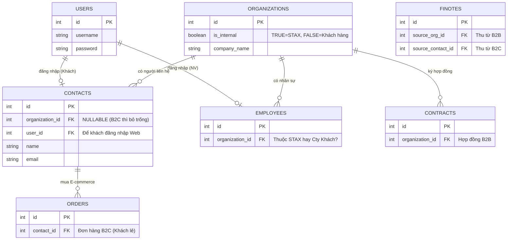
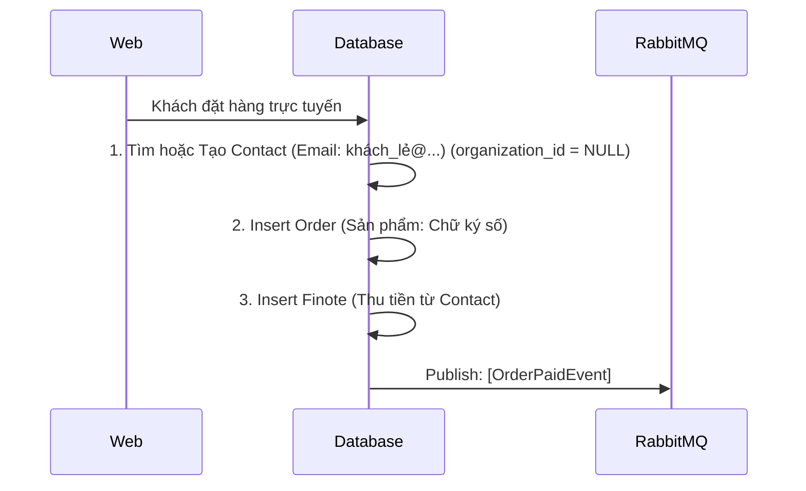
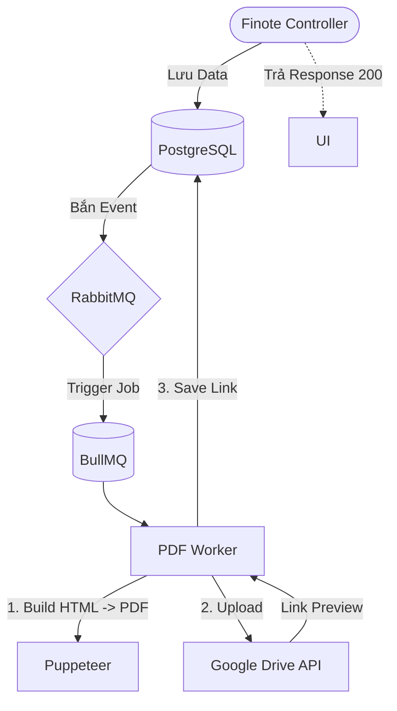

# 🏗️ TÀI LIỆU KIẾN TRÚC TỔNG THỂ HỆ THỐNG ERP/HRM/CRM (STAX ENTERPRISE)

## 1. TRIẾT LÝ THIẾT KẾ CỐT LÕI (CORE PHILOSOPHY)

Hệ thống được thiết kế dựa trên 4 trụ cột kiến trúc, đảm bảo khả năng mở rộng từ một công ty đơn lẻ (Single-tenant) lên nền tảng đa doanh nghiệp (SaaS Multi-tenant) mà không cần đập đi xây lại:

1.  **Organization-Centric (Mọi thứ xoay quanh Organization):** Bảng `Organizations` là "Mặt trời" của hệ thống. Nó đại diện cho mọi thực thể có tư cách pháp nhân. Cờ `is_internal` sẽ quyết định thực thể đó là STAX (Chủ sở hữu) hay là Khách hàng/Đối tác. Toàn bộ sơ đồ nhân sự (HRM) hay Hợp đồng (CRM) đều được neo (hook) vào một Organization ID.
2.  **Entity-Process Separation (Tách biệt Thực thể & Tiến trình):** 
    *   *Thực thể (Entity - DNA):* `Organizations` (Doanh nghiệp), `Contacts` (Con người). Dữ liệu này tồn tại vĩnh viễn và không bị sao chép.
    *   *Tiến trình (Process):* `Leads` (Đang tư vấn), `Contracts` (Đang phục vụ), `Orders` (Đang mua hàng). 
3.  **Omnichannel Ready (Hỗ trợ cả B2B và B2C):** Nhờ việc tách `Contacts` ra khỏi `Organizations`, hệ thống xử lý mượt mà cả hợp đồng doanh nghiệp (B2B) lẫn giỏ hàng thương mại điện tử cá nhân (B2C).
4.  **Kiến trúc vĩ mô (DDD, Clean Architecture & Event-Driven):** Tách biệt hoàn toàn Business Logic khỏi Framework, giao tiếp liên module thông qua Message Queue (RabbitMQ) và Task Queue (BullMQ).

---

## 2. NGÔN NGỮ NGHIỆP VỤ & QUY CHUẨN ĐẶT TÊN (UBIQUITOUS LANGUAGE)

Trong Domain-Driven Design (DDD), việc thống nhất ngôn ngữ giữa Đội Lập trình (Dev) và Đội Kinh doanh (Biz) là yếu tố sống còn. Chúng ta không đặt tên theo *định nghĩa sinh học/vật lý*, mà đặt tên theo **Vai trò Nghiệp vụ (Business Intent)**.

### A. Bảng Đối Trọng: Tại sao chọn tên này mà không phải tên khác?

| Thuật ngữ chọn dùng | Thuật ngữ bị loại bỏ | Góc nhìn & Vai trò Nghiệp vụ (Tại sao chọn?) |
| :--- | :--- | :--- |
| **`Contact`** | *`Person`, `People`* | `Person` chỉ là "con người" (quá chung chung). `Contact` mang ý nghĩa kinh doanh: Đây là "Người liên hệ" bên ngoài (External) mà Sales/CSKH dùng để giao tiếp, chốt sale (B2B) hoặc mua lẻ (B2C). |
| **`Organization`** | *`Company`, `Client`* | Không dùng `Company` vì đối tác có thể là Trường học, Quỹ NGO, Hộ kinh doanh. Không dùng `Client` vì thực thể này có thể là Nhà cung cấp (Vendor) hoặc chính STAX. `Organization` (Tổ chức) bao hàm được tất cả. |
| **`Employee`** | *`Staff`, `User`* | Đây là nhân sự nội bộ (Internal). Dùng `Employee` để gắn liền với nghiệp vụ HRM (Chấm công, tính lương, cấp bậc). |
| **`User`** | *`Account`, `Member`* | Chỉ dùng cho Tầng Hệ thống (System/Auth). Đại diện cho tập hợp Credentials (Username, Password, Session) để đăng nhập. Một `User` có thể map với 1 `Employee` hoặc 1 `Contact`. |
| **`OrgUnit` / `Department`**| *`Group`, `Team`* | Chỉ cơ cấu phân cấp phòng ban nội bộ của một `Organization`. |
| **`Finote`** | *`Transaction`, `Bill`* | Kết hợp giữa Financial + Note (Phiếu Thu/Chi). Từ khóa đặc trưng của STAX. |

### B. Quy chuẩn Coding & Database
*   **Database Schema:** `snake_case` số nhiều (VD: `organizations`, `service_assignments`).
*   **Primary/Foreign Keys:** PK luôn là `id`. FK luôn là `tên_bảng_số_ít_id` (VD: `organization_id`).
*   **Boolean:** Luôn có tiền tố `is_`, `has_` (VD: `is_internal`, `has_discount`).
*   **Domain Events:** `[Thực Thể][Hành Động Quá Khứ]Event` (VD: `ContractSignedEvent`, `ClientOnboardedEvent`).

---

## 3. SƠ ĐỒ THỰC THỂ ĐA MÔ HÌNH (OMNICHANNEL ERD)

Sơ đồ này minh họa sức mạnh của việc tách `Contacts` và cách mọi thứ xoay quanh `Organizations`.

---

## 4. CHIẾN LƯỢC KIẾN TRÚC MỞ RỘNG (SCALABILITY ARCHITECTURE)

Việc áp dụng **Clean Architecture (Ports & Adapters)** và **Event-Driven** giúp hệ thống tổ chức lỏng lẻo (Loosely Coupled) nhưng hiệp đồng chặt chẽ:

1.  **Ports & Adapters (Hexagonal Architecture):**
    *   Tầng `Domain` không biết DB là gì (Drizzle hay TypeORM), không biết đang lưu file ở đâu (S3 hay Google Drive).
    *   *Lợi ích:* Khi STAX lớn lên, việc đổi Storage từ Google Drive sang AWS S3 chỉ mất 1 ngày code thêm `S3Adapter` mà không chạm vào 1 dòng logic tạo Hóa đơn nào.
2.  **Event-Driven (Sự kiện điều hướng):**
    *   Các module (CRM, Accounting, HRM) **KHÔNG import Service của nhau**. Chúng giao tiếp bằng `RabbitMQ`.
    *   *Ví dụ:* Khi Hợp đồng ký xong, module CRM bắn event `[ContractSigned]`. Module Accounting tự động bắt event này và tạo `Finote` thu tiền đợt 1. Module HRM bắt event này để tính KPI cho Sales.
3.  **Background Processing (BullMQ):**
    *   Không để API phải chờ đợi các tác vụ I/O chậm (Sinh PDF, Upload file, Gửi Email). API trả về `201 Created` trong 50ms, các task nặng đẩy vào BullMQ cho Worker tự xử lý và báo cáo lại trạng thái.

---

## 5. CÁC LUỒNG NGHIỆP VỤ CỐT LÕI (CORE WORKFLOWS)

### Luồng 1: Chốt Sale Doanh Nghiệp (B2B CRM Workflow)
**Mục tiêu:** Tạo pháp nhân, ký hợp đồng và bàn giao đội ngũ vận hành.

```mermaid
sequenceDiagram
    participant Sales
    participant DB as Database (Tx)
    participant RMQ as RabbitMQ

    Sales->>DB: Nhập thông tin Công ty (Organization) & Người đại diện (Contact)
    Sales->>DB: Nhấn [CHỐT HỢP ĐỒNG]
    rect rgb(10, 18, 25)
        Note right of DB: Bắt đầu Transaction
        DB->>DB: 1. Update Lead (Stage = WON)
        DB->>DB: 2. Update Organization (Status = ACTIVE)
        DB->>DB: 3. Insert Contract (Hợp đồng Kế toán)
        DB->>DB: 4. Insert Service_Assignments (Gán 6 nhân viên STAX)
        Note right of DB: Commit Transaction
    end
    DB->>RMQ: Publish: [ClientOnboardedEvent]
```

### Luồng 2: Khách Hàng Cá Nhân Mua Lẻ (B2C E-commerce Workflow)
**Mục tiêu:** Xử lý khách vãng lai mua lẻ sản phẩm (Phần mềm, Chữ ký số) không dính dáng đến B2B.

### Luồng 3: Kế Toán Sinh Hóa Đơn & Lưu Trữ Đám Mây (Async Workflow)
**Mục tiêu:** Đảm bảo trải nghiệm UI siêu tốc, dời việc nặng xuống Background.

---

## 6. LỘ TRÌNH THỰC THI (ROADMAP)

**Phase 1: Refactor Database (Tuần 1)**
1.  Tạo bảng `contacts` (Tách người khỏi công ty).
2.  Bổ sung `organization_id` vào `org_units` và `employees`.
3.  Tạo bảng `service_assignments` (Đội ngũ 6 người phục vụ).

**Phase 2: Áp dụng Message & Task Queue (Tuần 2)**
1.  Cài đặt RabbitMQ thay thế cho `InMemoryEventBus`.
2.  Cài đặt BullMQ (Redis) để xử lý `PuppeteerPdfGeneratorAdapter`.

**Phase 3: Module Bán lẻ (Tương lai)**
1.  Triển khai bảng `orders` và `products` gắn vào `contacts`.
2.  Mở cổng thanh toán (Payment Gateway).

Tài liệu này là cam kết thiết kế của toàn bộ Đội ngũ Phát triển STAX. Bằng cách tuân thủ tuyệt đối **Ubiquitous Language** và giữ **Organizations** làm trung tâm, hệ thống đảm bảo duy trì tính tinh gọn, toàn vẹn dữ liệu và khả năng mở rộng không giới hạn trong kỷ nguyên số hóa.