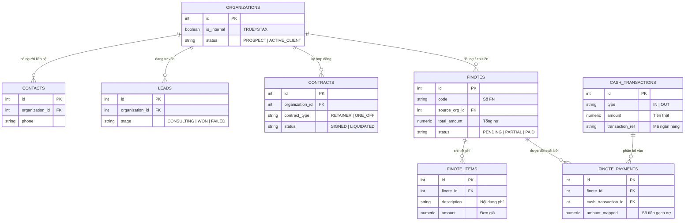
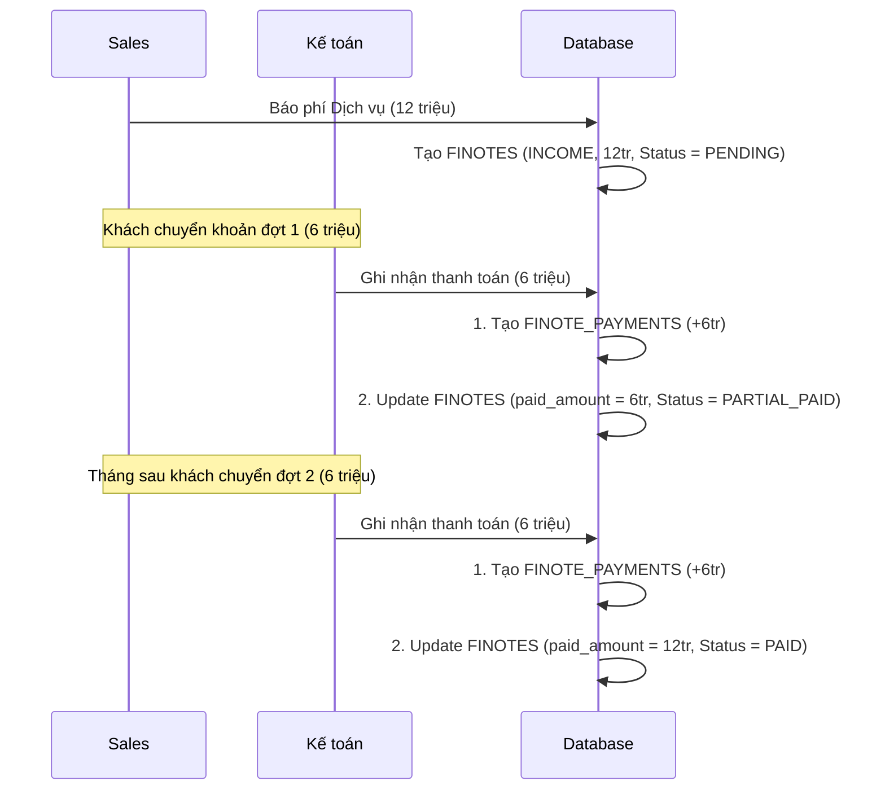

# 🏗️ TÀI LIỆU KIẾN TRÚC TỔNG THỂ HỆ THỐNG ERP/HRM/CRM (STAX ENTERPRISE)

## 1. TRIẾT LÝ THIẾT KẾ CỐT LÕI (CORE PHILOSOPHY)

Hệ thống được thiết kế dựa trên 4 trụ cột kiến trúc, đảm bảo khả năng mở rộng từ một công ty đơn lẻ (Single-tenant) lên nền tảng đa doanh nghiệp (SaaS Multi-tenant) mà không cần đập đi xây lại:

1.  **Organization-Centric (Mọi thứ xoay quanh Organization):** Bảng `Organizations` là "Mặt trời" của hệ thống. Nó đại diện cho mọi thực thể có tư cách pháp nhân. Cờ `is_internal` sẽ quyết định thực thể đó là STAX (Chủ sở hữu) hay là Khách hàng/Đối tác. Sơ đồ nhân sự (HRM) hay Hợp đồng (CRM) đều được neo vào một Organization ID.
2.  **Entity-Process Separation (Tách biệt Thực thể & Tiến trình):** 
    *   *Thực thể (Entity - DNA):* `Organizations` (Doanh nghiệp), `Contacts` (Con người). Dữ liệu này tồn tại vĩnh viễn.
    *   *Tiến trình (Process):* `Leads` (Đang tư vấn), `Contracts` (Đang phục vụ), `Finotes` (Đang nợ). 
3.  **Tách biệt Giao diện và Lõi hệ thống (Presentation vs Core):** Giao diện sử dụng thuật ngữ thân thiện với người dùng (Thu tiền, Chi tiền, Tạm ứng). Nhưng Database lõi quy về một chuẩn duy nhất (Single-Table Design) để tối ưu hóa việc thống kê dòng tiền.
4.  **Kiến trúc vĩ mô (DDD, Clean Architecture & Event-Driven):** Tách biệt hoàn toàn Business Logic khỏi Framework, giao tiếp liên module thông qua Message Queue.

---

## 2. NGÔN NGỮ NGHIỆP VỤ & QUY CHUẨN ĐẶT TÊN (UBIQUITOUS LANGUAGE)

Trong Domain-Driven Design (DDD), việc thống nhất ngôn ngữ giữa Đội Lập trình (Dev) và Đội Kinh doanh (Biz) là yếu tố sống còn. 

### A. Bảng Đối Trọng: Tại sao chọn tên này mà không phải tên khác?

| Thuật ngữ STAX (Operation) | Thuật ngữ Lõi Database | Góc nhìn & Vai trò Nghiệp vụ (Tại sao chọn?) |
| :--- | :--- | :--- |
| **Doanh nghiệp / Khách hàng** | `Organization` | Đại diện chung cho B2B. Client sẽ có `status` là `PROSPECT`, `ACTIVE_CLIENT` hoặc `INACTIVE_CLIENT`. |
| **Người liên hệ** | `Contact` | Người đại diện công ty hoặc khách lẻ B2C. |
| **Gói dịch vụ 1 lần (One Off)** | `contract_type = 'ONE_OFF'` | "One OFF" là *Tính chất* của dịch vụ, không phải *Trạng thái* hợp đồng. Trạng thái Hợp đồng chỉ bao gồm: Đã ký, Chờ ký, Tạm ngưng, Thanh lý. |
| **Giấy Đề Nghị / Lệnh thu tiền** | `Finote` | Đây là tờ giấy ghi nhận **CÔNG NỢ** (Yêu cầu thanh toán). Finote có Type = `INCOME` (Đòi tiền) hoặc `EXPENSE` (Xin chi tiền). Format: `FEN-<MST>-YYYYMMDD-<Seq>`. |
| **Dòng tiền / Sao kê** | `Finote Payment` | Đây là **TIỀN THẬT** (Cashflow). Khách hàng có thể trả góp nhiều lần cho 1 Finote. Bảng này lưu vết tiền vào ra chính xác lúc nào, do ai xác nhận. |

### B. Quy chuẩn Coding & Database
*   **Database Schema:** `snake_case` số nhiều (VD: `organizations`, `finote_payments`).
*   **Primary/Foreign Keys:** PK luôn là `id`. FK luôn là `tên_bảng_số_ít_id` (VD: `organization_id`).
*   **Domain Events:** `[Thực Thể][Hành Động Quá Khứ]Event` (VD: `ContractSignedEvent`, `FinotePaidEvent`).

---

## 3. SƠ ĐỒ THỰC THỂ ĐA MÔ HÌNH (OMNICHANNEL ERD)

Sơ đồ này minh họa việc tách biệt Entities, Processes và Cashflow.

---

## 4. CHIẾN LƯỢC KIẾN TRÚC MỞ RỘNG (SCALABILITY ARCHITECTURE)

1.  **Ports & Adapters (Hexagonal Architecture):**
    *   Tầng `Domain` không biết DB là gì. Việc đổi Storage chỉ cần code thêm Adapter.
2.  **Event-Driven (Sự kiện điều hướng):**
    *   Các module (CRM, Accounting, HRM) **KHÔNG import Service của nhau**. Giao tiếp qua Message Queue (RabbitMQ/Kafka).
3.  **Background Processing (BullMQ):**
    *   API trả về `201 Created` cực nhanh. Các task I/O (Sinh PDF, Upload Drive, Gửi Mail) đẩy vào BullMQ cho Worker tự xử lý.

---

## 5. CÁC LUỒNG NGHIỆP VỤ CỐT LÕI (CORE WORKFLOWS)

### Luồng 1: Chốt Sale Doanh Nghiệp (CRM Workflow)
**Mục tiêu:** Tạo pháp nhân, ký hợp đồng và bàn giao đội ngũ vận hành.

```mermaid
sequenceDiagram
    participant Sales
    participant DB as Database (Tx)
    participant RMQ as RabbitMQ

    Sales->>DB: Nhập thông tin Khách hàng & Nhu cầu vào LEAD
    Sales->>DB: Nhấn[CHỐT HỢP ĐỒNG]
    rect rgb(10, 18, 25)
        Note right of DB: Bắt đầu Transaction
        DB->>DB: 1. Update Lead (Stage = WON)
        DB->>DB: 2. Update Organization (Status = ACTIVE_CLIENT)
        DB->>DB: 3. Insert Contract (Hợp đồng Kế toán / One-off)
        DB->>DB: 4. Insert Service_Assignments (Gán nhân viên vận hành)
        Note right of DB: Commit Transaction
    end
    DB->>RMQ: Publish: [ClientOnboardedEvent]
```

### Luồng 2: Quản lý Công nợ & Dòng tiền (Follow Cash Workflow)
**Mục tiêu:** Phân tách rõ ràng giữa Việc tạo giấy đòi tiền và Tiền thực tế vào tài khoản. Cho phép thanh toán trả góp nhiều đợt.

---

## 6. LỘ TRÌNH THỰC THI (ROADMAP)

**Phase 1: Chuẩn hóa Domain DB (Đang diễn ra)**
1.  Tách biệt `Contacts` và `Organizations`.
2.  Refactor `Contracts` (Type: Retainer/One-off, Status: Signed/Liquidated).
3.  Refactor Kế toán: Tách bạch `Finotes` (Công nợ) và `Finote_Payments` (Dòng tiền).

**Phase 2: Áp dụng Message & Task Queue (Kế tiếp)**
1.  Kích hoạt `RabbitMQEventBusAdapter` thay thế in-memory.
2.  Đưa quy trình sinh PDF của Finote vào `BullMQ` (Background Job).

**Phase 3: Module Bán lẻ (B2C)**
1.  Triển khai bảng `orders` gắn vào `contacts`.
2.  Tích hợp Payment Gateway tự động gạch nợ `Finote_Payments`.

---

## 7. Hồ sơ Quyết định Kiến trúc (Architectural Decisions)

### 7.1. Xuất bản Repository ra ngoài Module (Exporting Repositories)
- **Quyết định:** Export `IOrganizationRepository` và `IContactRepository` từ CRM Module.
- **Lý do:** 
    - Bảng `Organizations` là "Cột sống" dữ liệu chung của toàn hệ thống (Multi-tenancy). Các module Kế toán, HRM cần truy cập thông tin định danh khách hàng thường xuyên.
    - Tránh việc viết quá nhiều hàm "pass-through" (lấy dữ liệu hộ) trong Service gây phình to mã nguồn không cần thiết.
- **Rủi ro & Giải pháp:** Có thể gây rò rỉ chi tiết dữ liệu. Trong tương lai, khi module phình to, sẽ chuyển các thực thể lõi này vào một `SharedDomainModule` riêng biệt.

---

## 8. Lộ trình Phát triển Tiếp theo (Future Roadmap)

### 8.1. Intelligent Lead Intake Phase 2
- **AI-Powered Parsing:** Tích hợp AI để tự động đọc nội dung chat từ Zalo/Email và điền vào form Intake.
- **Auto-Deduplication:** Nâng cấp thuật toán check trùng khách hàng không chỉ qua SĐT mà còn qua MST cá nhân, Email hoặc Tên không dấu gần giống.

### 8.2. Hệ thống Activity Timeline (UX Hoàn hảo)
- **Xây dựng:** Một hệ thống theo dõi mọi thay đổi và tương tác với khách hàng.
- **Chi tiết:** Khi Sales gọi điện, khi Ops duyệt Finote, hệ thống tự động ghi lại thành một dòng thời gian (Feed). Giúp bất kỳ ai nhảy vào cũng nắm được lịch sử của khách hàng trong 10 giây.

### 8.3. Check-list Nghiệp vụ Đặc thù (Workflow-based Tasks)
- **Thành lập Doanh nghiệp:** Tự động sinh danh mục giấy tờ cần thu thập (CCCD, Hợp đồng thuê nhà).
- **Kế toán Thuế:** Tự động nhắc nhở nhân viên thu thập hóa đơn đầu vào/đầu ra vào ngày 25 hàng tháng.

### 8.4. Master Dashboard cho Sếp STAX
- Thống kê tỷ lệ chuyển đổi từ Lead sang Hợp đồng (Conversion Rate).
- Biểu đồ dòng tiền thực tế so với công nợ chưa thu (Cash Flow vs. Receivables).
- Báo cáo năng suất nhân viên dựa trên số lượng Task và Finote được xử lý.

---
*Tài liệu được cập nhật ngày 24/04/2026 theo chiến lược Clean Architecture & Domain-Driven Design.*
