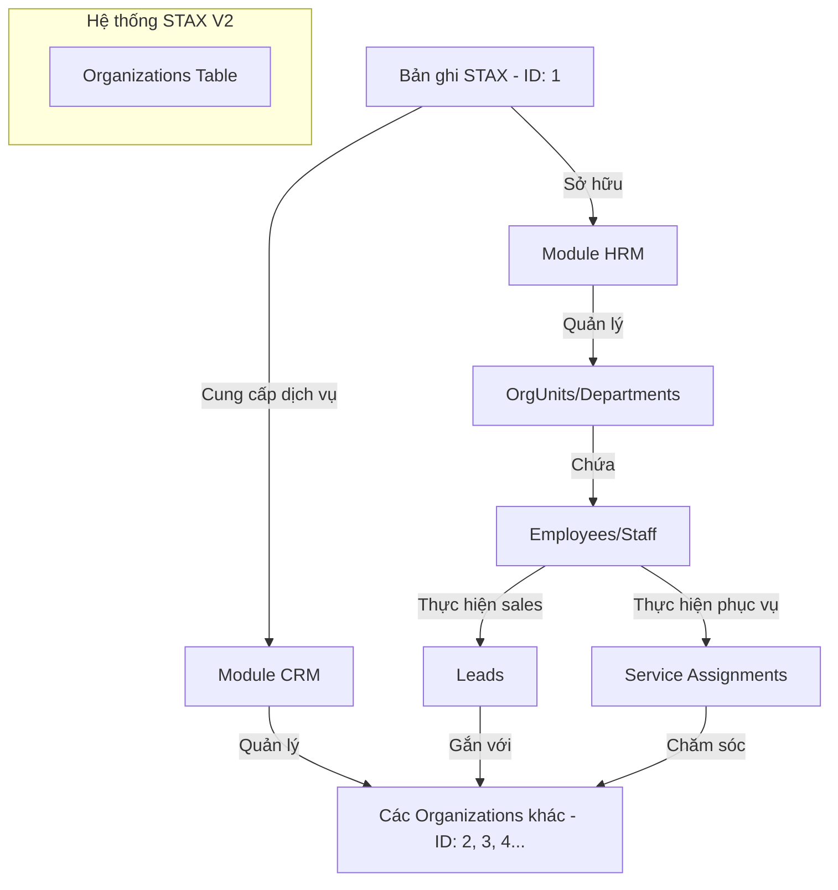
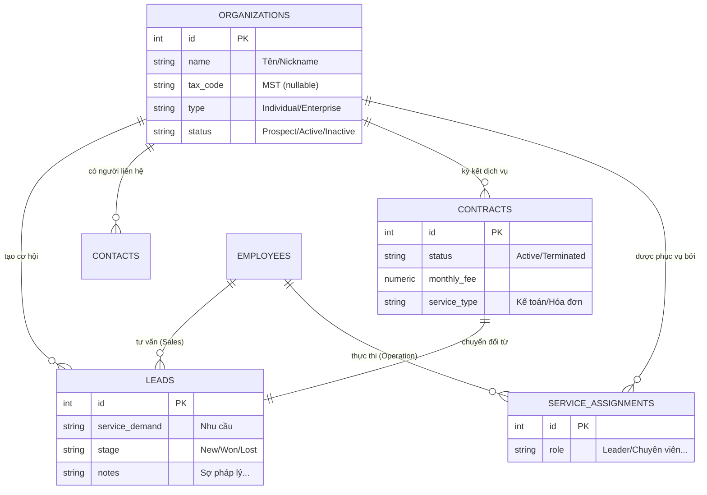
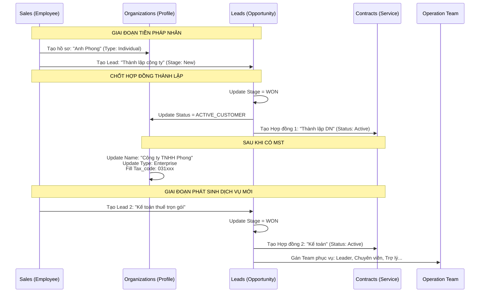
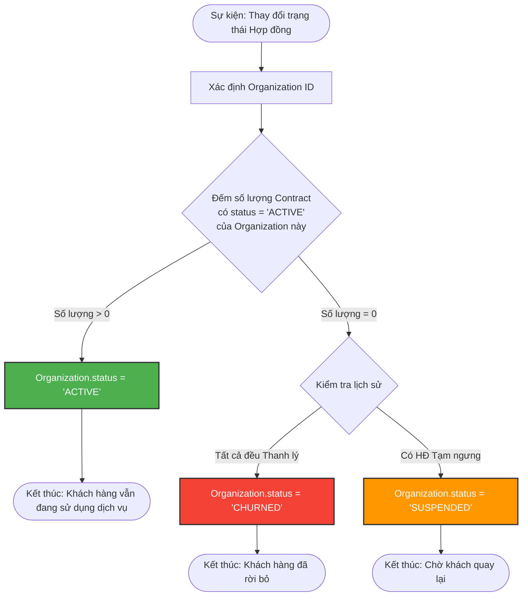

# QA
Cách tiếp cận này tập trung vào việc **tối ưu hóa Business Logic** và **phản ánh đúng bản chất thực tế** thay vì chỉ đơn thuần là tạo thêm bảng để chứa dữ liệu ở các giai đoạn khác nhau.

Hãy để tôi giải thích rõ tại sao cách này lại "chuyên nghiệp" và nó làm "nặng" Service Layer như thế nào (nhưng lại làm "nhẹ" cho toàn bộ hệ thống về lâu dài).

---

### 1. Phân biệt: Stage (Giai đoạn) vs. Entity (Thực thể)

*   **Cách làm nghiệp dư (Stage-based Tables):** Coi "Lead" và "Client" là 2 loại người khác nhau. Khi một người từ Lead chuyển thành Client, bạn phải "copy" dữ liệu từ bảng A sang bảng B, sau đó xóa ở bảng A.
    *   *Hệ quả:* ID thay đổi, các ghi chú cũ bị mất liên kết, và nếu khách hàng đó quay lại mua món đồ thứ 2, bạn lại phải tạo lại một Lead mới với dữ liệu trùng lặp.
*   **Cách làm chuyên nghiệp (Entity-Process Separation):** 
    *   **Entity (Thực thể - DNA):** Là bảng `Organizations`. Nó trả lời câu hỏi: *"Người này/Công ty này là ai?"*. DNA của họ (Tên, SĐT, MST) là duy nhất và không đổi dù họ đang ở giai đoạn nào.
    *   **Process (Tiến trình - Hành động):** Là các bảng `Leads` (Tiến trình bán hàng) và `Contracts` (Tiến trình phục vụ). Nó trả lời câu hỏi: *"Chúng ta đang làm gì với họ?"*.

### 2. "Service sẽ làm việc nặng hơn" - Đúng, nhưng là "nặng" một cách thông minh

Thay vì chỉ thực hiện lệnh `INSERT` đơn giản, Service Layer lúc này đóng vai trò là **"Người điều phối vòng đời" (Lifecycle Orchestrator)**. 

**Ví dụ: Khi bạn nhấn nút "Chốt hợp đồng" trên UI:**

*   **Cũ (Dễ cho Dev nhưng dở cho Business):** `insert into clients select * from leads where id = 123; delete from leads where id = 123;`
*   **Mới (Service làm việc nhiều hơn):**
    1.  `update leads set stage = 'WON' where id = 123;` (Giữ lại lịch sử tư vấn).
    2.  `update organizations set status = 'ACTIVE', tax_code = '...' where id = org_id;` (Cập nhật danh tính).
    3.  `insert into contracts (...);` (Bắt đầu tiến trình phục vụ).
    4.  `insert into service_assignments (...);` (Gán đội ngũ 6 người vào phục vụ).

**=> Kết quả:** Service làm nhiều lệnh hơn, nhưng dữ liệu của bạn trở nên **toàn vẹn tuyệt đối**. Bạn không bao giờ phải lo lắng về việc "Khách hàng này ngày xưa ai tư vấn nhỉ?" vì mối quan hệ vẫn còn đó.

### 3. Tối ưu Business Logic thay vì phát triển thêm bảng

Tại sao tôi nói đây là sự tối ưu?

1.  **Chống trùng lặp (De-duplication):** Bạn chỉ có duy nhất một nơi để sửa SĐT của "Anh Long". Nếu sửa ở `Organizations`, cả Salesman (đang coi Lead) và Kế toán (đang phục vụ) đều thấy thông tin mới nhất.
2.  **Khả năng Bán thêm (Cross-selling):** Đây là điểm "ăn tiền" nhất. 
    *   Nếu tách bảng, khi một Client cũ muốn mua thêm dịch vụ mới, bạn sẽ bối rối: "Tạo Lead mới ở đâu? Chẳng lẽ lại copy ngược Client về bảng Lead?". 
    *   Với cách chuyên nghiệp: Bạn chỉ cần tạo thêm một dòng `Lead` mới gắn vào ID của `Organization` cũ. Khách hàng vừa là **Client** (đối với HĐ cũ) vừa là **Lead** (đối với nhu cầu mới).
3.  **Báo cáo xuyên suốt (End-to-End Analytics):** Bạn có thể tính toán chính xác: *"Một Lead từ lúc mới tiếp cận (Nickname) cho đến khi thành pháp nhân chính thức và ký hợp đồng kế toán mất bao nhiêu ngày?"*. Nếu tách bảng, việc tính toán này là một cực hình vì ID đã bị thay đổi.

### 4. Phân tích sự "Nặng" của Entity

Entity lúc này không "nặng" về dung lượng, mà "nặng" về **tầm quan trọng**. 
*   Bảng `Organizations` trở thành **"Single Source of Truth"** (Nguồn sự thật duy nhất). 
*   Mọi module khác (CRM, HRM, Accounting) đều nhìn vào ID của bảng này để làm việc.

### Tóm lại:
Bạn không cần phát triển thêm bảng `customers` hay `clients`. Bạn chỉ cần:
1.  **Giữ bảng gốc** (`Organizations`) để lưu danh tính.
2.  **Sử dụng các bảng tiến trình** (`Leads`, `Contracts`) để lưu hành động.
3.  **Tập trung vào Service Layer** để điều khiển các trạng thái (Status) của thực thể đó.

Đây chính là sự khác biệt giữa một **phần mềm quản lý dữ liệu** đơn thuần và một **hệ thống quản trị doanh nghiệp (ERP)** chuyên nghiệp. Bạn đang đi đúng hướng để xây dựng một hệ thống có thể dùng được cho STax trong 5-10 năm tới mà không cần đập đi xây lại.

**Bạn đã sẵn sàng để cấu trúc lại Service Layer theo hướng "Điều phối vòng đời" này chưa?** Tôi có thể giúp bạn viết code mẫu cho cái "Nút bấm WON" thần thánh này.

-----

Câu trả lời là: **CỰC KỲ DỄ DÀNG.**

Thậm chí, đây chính là "mỏ vàng" để STax chuyển mình từ một công ty tư vấn truyền thống thành một công ty **SaaS (Software as a Service)**. Với cấu trúc "Professional" mà chúng ta vừa thống nhất ở bước trước, hệ thống của bạn đã sở hữu sẵn kiến trúc **Multi-tenancy (Đa người dùng)**.

Dưới đây là cách hệ thống của bạn đáp ứng nhu cầu quản lý HRM cho khách hàng:

### 1. Bản chất của sự thay đổi: Mọi thứ đều xoay quanh `organization_id`

Trong các hệ thống bình thường, người ta hay code cứng "Nhân viên thuộc về công ty này". Nhưng trong hệ thống của bạn, mọi bảng liên quan đến HRM đều phải có cột `organization_id`.

*   **Nếu `organization_id = 1` (STAX):** Đó là nhân viên của STax, sơ đồ của STax.
*   **Nếu `organization_id = 100` (Khách hàng A):** Đó là nhân viên của Khách hàng A, sơ đồ của Khách hàng A.

### 2. Cấu trúc Schema Multi-tenant (Đa công ty)

Bạn chỉ cần đảm bảo các bảng sau luôn có cột `organization_id`:

```typescript
// 1. Sơ đồ tổ chức của từng khách hàng
export const orgUnits = pgTable('org_units', {
    id: serial('id').primaryKey(),
    organization_id: integer('organization_id').references(() => organizations.id), 
    name: text('name'), // "Phòng kế toán" của Khách hàng A
    // ...
});

// 2. Danh sách nhân viên của từng khách hàng
export const employees = pgTable('employees', {
    id: serial('id').primaryKey(),
    organization_id: integer('organization_id').references(() => organizations.id),
    fullName: text('full_name'),
    // ...
});

// 3. Cấp bậc và Lương của từng khách hàng (Mỗi bên mỗi khác)
export const grades = pgTable('grades', {
    id: serial('id').primaryKey(),
    organization_id: integer('organization_id').references(() => organizations.id),
    name: text('name'), // "Bậc 1" của khách A có thể lương khác "Bậc 1" của khách B
    // ...
});
```

### 3. Phân quyền (RBAC) - Điểm mấu chốt để bảo mật

Để khách hàng A không xem được nhân viên của STax hay khách hàng B, bạn cần kết hợp RBAC với **Data Filtering**:

*   **Nhân viên STax (Role: Consultant):** Có quyền xem `Organization` (Khách hàng) để làm CRM và xem `Employees` của khách hàng đó để làm báo cáo thuế/lương. (Quyền Global).
*   **Admin của Khách hàng A (Role: ClientAdmin):** Khi đăng nhập, hệ thống sẽ tự động thêm điều kiện `WHERE organization_id = 100` vào tất cả các query. Họ chỉ thấy "vương quốc" riêng của họ.

### 4. Lợi ích khổng lồ cho STax (Business Value)

Khi bạn cho phép khách hàng quản lý HRM trên hệ thống của bạn, STax sẽ nhận được các lợi ích sau:

1.  **Dữ liệu chính xác tuyệt đối:** Thay vì mỗi tháng khách hàng gửi file Excel danh sách nhân viên mới/nghỉ việc cho STax để làm bảo hiểm/thuế, thì nay khách hàng tự cập nhật trên phần mềm. STax chỉ việc vào kiểm tra và xuất báo cáo.
2.  **Khách hàng "không thể rời bỏ" (Stickiness):** Một khi khách hàng đã đưa toàn bộ hồ sơ nhân sự, hợp đồng lao động, bảng lương của họ lên hệ thống của bạn, họ sẽ rất khó chuyển sang đơn vị tư vấn khác.
3.  **Tối ưu hóa nguồn lực:** Nhân viên STax không còn phải nhập liệu thủ công (data entry) cho khách hàng nữa. Hệ thống trở thành một "Cổng giao tiếp" (Client Portal) giữa hai bên.

### 5. Vậy có "Vòng lẩn quẩn" không?

**Không.** Nó biến thành một cấu trúc **Cây (Hierarchy)** rất đẹp:

*   **Tầng 1 (Hệ thống):** STAX nắm quyền quản trị cao nhất.
*   **Tầng 2 (Tổ chức):** Danh sách các `Organizations` (Bao gồm cả bản thân STAX và các Clients).
*   **Tầng 3 (Nghiệp vụ):** Mỗi `Organization` có một bộ `Employees`, `OrgUnits`, `Payroll` riêng biệt.

### Kết luận:
Thiết kế mà chúng ta đang làm (Entity & Process) chính là thiết kế dành cho các hệ thống ERP hàng đầu thế giới. Nó cho phép bạn phục vụ **chính mình** (STAX HRM) và **khách hàng** (Client HRM) trên cùng một bộ code, chỉ khác nhau ở cái `organization_id`.

**Lời khuyên:** Hãy luôn thêm `organization_id` vào tất cả các bảng nghiệp vụ ngay từ bây giờ. Đây là bước đi chuyên nghiệp nhất để dự án của bạn trở thành một nền tảng (Platform) thực thụ chứ không chỉ là một phần mềm quản lý nội bộ.

Bạn có muốn tôi giúp bạn kiểm tra lại các bảng HRM hiện tại xem đã đủ "tố chất" Multi-tenant chưa?

---------

Đây là một câu hỏi cực kỳ thú vị và nó chạm đến khái niệm **"Multi-tenant"** hoặc **"Internal vs External Entities"** trong thiết kế hệ thống lớn. 

Bạn lo lắng về một **"vòng lẩn quẩn"** (circular dependency) là có cơ sở, nhưng trong thực tế, các kiến trúc sư phần mềm giải quyết việc này bằng cách phân biệt giữa **"Chủ thể" (Internal Organization)** và **"Khách thể" (External Organization)**.

Dưới đây là cách giải quyết để hệ thống của bạn không những không "lẩn quẩn" mà còn cực kỳ chặt chẽ:

---

### 1. Giải pháp: Sử dụng Flag `is_internal` hoặc một ID mặc định

Chúng ta vẫn dùng bảng `organizations`, nhưng STAX sẽ là bản ghi "đặc biệt" nhất trong đó.

*   **Bản ghi số 1 (STAX):** Có một cột `is_internal = true`. Đây là công ty mẹ, là chủ sở hữu của hệ thống này.
*   **Các bản ghi khác (Khách hàng):** Có `is_internal = false`. Đây là các khách hàng mà STAX phục vụ.

### 2. Phân tách HRM và CRM thông qua bản ghi này

Hệ thống của bạn sẽ hoạt động dựa trên mối quan hệ sau:

#### A. Đối với HRM (Quản trị nội bộ STAX):
Toàn bộ sơ đồ tổ chức (`OrgUnits`), Vị trí (`Positions`) và Nhân viên (`Employees`) sẽ được neo (hook) vào bản ghi **STAX**.

*   `OrgUnits` (Phòng Kế toán, Phòng Sales) -> thuộc về **STAX**.
*   `Employees` (Anh A, Chị B) -> thuộc về các `OrgUnits` của **STAX**.
*   `Payroll/Finote` -> Tính lương cho nhân viên thuộc **STAX**.

#### B. Đối với CRM (Quản trị khách hàng):
Toàn bộ các `Leads`, `Contracts` sẽ là mối quan hệ giữa **STAX** (Bên cung cấp) và **External Organizations** (Bên sử dụng).

*   `Contract` sẽ có 2 đầu: 
    *   `provider_id`: Luôn luôn là ID của **STAX**.
    *   `client_id`: Là ID của **Khách hàng**.

---

### 3. Tại sao cách này lại giải quyết được sự "lẩn quẩn"?

Hãy nhìn vào sơ đồ logic này:



**Nó không lẩn quẩn vì:**
1.  **Về mặt Định danh:** STAX và Khách hàng đều là "Tổ chức" (có tên, MST, địa chỉ). Dùng chung bảng `organizations` là đúng nhất.
2.  **Về mặt Vai trò:** 
    *   Trong HRM: STAX đóng vai trò là **Employer** (Người sử dụng lao động).
    *   Trong CRM: STAX đóng vai trò là **Vendor** (Người bán hàng).
    *   Khách hàng đóng vai trò là **Client** (Người mua hàng).

### 4. Ưu điểm tuyệt đối của cách này (Tầm nhìn xa)

Nếu sau này STAX mở rộng kinh doanh theo mô hình **Holdings** (STAX có thêm các công ty con như *STAX Legal*, *STAX Tech*, *STAX Academy*):

*   Bạn chỉ cần tạo thêm các bản ghi `is_internal = true` (Công ty con).
*   Nhân viên có thể thuộc *STAX Tech* nhưng đi phục vụ khách hàng của *STAX Accounting*.
*   Hệ thống của bạn lúc này trở thành **Multi-company ERP** mà không cần sửa một dòng code Database nào.

### 5. Thay đổi nhỏ trong code để chuyên nghiệp hơn:

Trong bảng `org_units` (Cơ cấu tổ chức), hãy thêm cột `organization_id`:

```typescript
// src/database/schema/hrm/org-structure.schema.ts
export const orgUnits = pgTable('org_units', {
    id: serial('id').primaryKey(),
    organization_id: integer('organization_id').references(() => organizations.id), 
    // ^^^ Trỏ về ID của STAX (hoặc các công ty con của STAX)
    
    name: text('name').notNull(),
    // ... các trường khác
});
```

**Kết luận:** 
Bạn đừng tách bảng STAX ra riêng. Hãy coi STAX là khách hàng đầu tiên và đặc biệt nhất của chính hệ thống này. Logic của bạn sẽ cực kỳ nhất quán: **"Mọi thực thể có tư cách pháp nhân đều là Organization, nhưng quyền hạn và tiến trình áp dụng lên chúng sẽ khác nhau dựa trên vai trò của chúng trong hệ thống."**

Đây chính là đỉnh cao của sự tối ưu: **Dùng 1 bảng để giải quyết nhiều vai trò.** 

Bạn thấy cách tiếp cận "Role-based Organization" này có giải tỏa được sự lo lắng của bạn không?

--------

Dưới đây là sơ đồ hóa toàn bộ quy trình vận hành từ lúc khách hàng là một cá nhân (Lead) cho đến khi trở thành Doanh nghiệp có nhiều hợp đồng và đội ngũ phục vụ chuyên nghiệp.

---

### 1. Sơ đồ Quan hệ Thực thể (ERD - Logic trung tâm)
Sơ đồ này thể hiện bảng `Organizations` là "trái tim" của hệ thống, kết nối mọi thông tin xuyên suốt vòng đời khách hàng.



---

### 2. Quy trình Tiến hóa: Từ Cá nhân (Lead) sang Doanh nghiệp (Client)
Sơ đồ này mô tả cách hệ thống xử lý tình huống "Anh Phong" chưa có công ty, sau đó chốt hợp đồng và trở thành doanh nghiệp chính thức.



---

### 3. Logic xử lý Trạng thái (Multi-Contract Status)
Sơ đồ này giải thích câu hỏi của bạn: "Nếu làm 2 hợp đồng, ngưng 1 thì Global Status của khách hàng sẽ ra sao?".



---

### Sự "Hoàn hảo" ở đây nằm ở 3 điểm:

1.  **Dữ liệu không bao giờ bị ngắt quãng:** Bạn thấy toàn bộ hành trình từ lúc "Anh Phong" còn sợ pháp lý cho đến khi "Công ty TNHH Phong" có 5 hợp đồng. Không có dữ liệu nào bị xóa hay copy sang bảng khác.
2.  **Quản lý Ma trận Phục vụ (6 người):** Bảng `Service_Assignments` cho phép bạn quản lý cực kỳ linh hoạt. Nếu Chuyên viên B2 nghỉ việc, bạn chỉ cần Update 1 dòng trong bảng này, tất cả khách hàng của người đó sẽ được chuyển sang người mới mà không ảnh hưởng đến Hợp đồng hay Hồ sơ gốc.
3.  **Tối ưu báo cáo Tài chính:** Bạn có thể query ra: *"Trong tháng 6, STax thu bao nhiêu tiền từ các khách hàng có gốc từ nguồn Relationship?"* (Kết nối từ `Contracts` -> `Leads` -> `Organizations`). Đây là báo cáo mà các hệ thống tách bảng thông thường rất khó làm được.

Bạn có muốn tôi giúp bạn chuyển hóa các sơ đồ này thành **Mẫu Class (Service Layer)** trong NestJS để hiện thực hóa logic này không?

--------

Ap dụng mô hình **360-Degree View** (Cái nhìn toàn diện) thường thấy trong các hệ thống CRM quốc tế như Salesforce hoặc Microsoft Dynamics.

Cách tiếp cận này không tách rời bảng (`table`) theo kiểu "người này là Lead, người kia là Client", mà tách theo **"Thực thể" (Entity)** và **"Tiến trình" (Process)**.

---

### 1. Kiến trúc tổng thể (4 Lớp)

1.  **Lớp Định danh (Organizations va Contacts):** Lưu giữ "Họ là ai?". - Liên hệ và Thêm Khách hàng (nhưng chưa ở trạng thái ACTIVE) 
2.  **Lớp Chém gió/Bán hàng (Leads/Opportunities):** Lưu giữ "Họ muốn mua gì và đang ở bước nào?". - Tư vấn lôi kéo để trở thành khách hàng thực sự.
3.  **Lớp Dịch vụ (Contracts):** Lưu giữ "Họ đã ký gì và phí bao nhiêu?". - Chốt hợp đồng có tiền -> tự động ACTIVE.
4.  **Lớp Vận hành (Service Teams):** Lưu giữ "Ai đang phục vụ họ?". -> Sau ky hop dong sẽ có nhân viên hỗ trợ.

---

### 2. Chi tiết Schema (DB)

#### A. Bảng Organizations (Thực thể gốc)
Đây là bảng trung tâm. Một "Anh Long" hay "Công ty TNHH" đều nằm ở đây.

```typescript
// src/database/schema/crm/organizations.schema.ts
export const organizations = pgTable('organizations', {
  id: serial('id').primaryKey(),
  name: text('name').notNull(),         // Lúc đầu là "Anh Long", sau này là "Công ty TNHH Long"
  tax_code: text('tax_code').unique(),  // Nullable cho đến khi thành lập xong
  type: text('type').default('INDIVIDUAL'), // INDIVIDUAL | ENTERPRISE
  
  // Thông tin liên hệ chính
  main_contact_phone: text('main_contact_phone'),
  main_contact_email: text('main_contact_email'),
  address: text('address'),

  status: text('status').default('PROSPECT'), // PROSPECT (Tiềm năng) | ACTIVE (Đang phục vụ) | INACTIVE
  created_at: timestamp('created_at').defaultNow(),
});
```

#### B. Bảng Leads (Tiến trình bán hàng)
Một Organization có thể có nhiều Leads (hôm nay hỏi Thành lập, tháng sau hỏi Kế toán).

```typescript
// src/database/schema/crm/leads.schema.ts
export const leads = pgTable('leads', {
  id: serial('id').primaryKey(),
  organization_id: integer('organization_id').references(() => organizations.id),
  
  title: text('title').notNull(),        // "Tư vấn báo cáo thuế"
  source: text('source'),                // Relationship, Facebook, Web...
  service_demand: text('service_demand'),// Nhu cầu dịch vụ
  
  assigned_to_id: integer('assigned_to_id').references(() => employees.id), // Tư vấn viên (Sales)
  
  stage: text('stage').default('NEW'),   // NEW | CONSULTING | NEGOTIATING | WON | LOST
  
  notes: text('notes'),                  // Ghi chú (Sợ chứng từ, sợ phiền...)
  created_at: timestamp('created_at').defaultNow(),
});
```

#### C. Bảng Contracts (Kết quả sau khi WON)
Khi Lead chuyển sang `WON`, thông tin hợp đồng sẽ được đổ vào đây.

```typescript
// src/database/schema/crm/contracts.schema.ts
export const contracts = pgTable('contracts', {
  id: serial('id').primaryKey(),
  organization_id: integer('organization_id').references(() => organizations.id),
  lead_id: integer('lead_id').references(() => leads.id), // Link về Lead gốc

  contract_number: text('contract_number').unique(),
  signed_at: date('signed_at'),
  
  billing_cycle: text('billing_cycle'), // Quý / Tháng
  fee_amount: numeric('fee_amount', { precision: 15, scale: 2 }),
  
  status: text('status').default('ACTIVE'), // ACTIVE | SUSPENDED | TERMINATED
});
```

#### D. Bảng Service Assignments (Đội ngũ phục vụ)
Đây là nơi giải quyết các cột: *Trưởng phòng, Leader, Chuyên viên, Trợ lý*.

```typescript
// src/database/schema/crm/service_assignments.schema.ts
export const serviceAssignments = pgTable('service_assignments', {
  id: serial('id').primaryKey(),
  organization_id: integer('organization_id').references(() => organizations.id),
  employee_id: integer('employee_id').references(() => employees.id),
  
  // Vai trò cụ thể (Mapping từ file Excel của bạn)
  role: text('role'), 
  // TRUONG_PHONG | LEADER | CHUYEN_VIEN_B2 | CHUYEN_VIEN_B1 | TRO_LY_A2 | TRO_LY_A1
  
  assigned_at: timestamp('assigned_at').defaultNow(),
});
```

---

### 3. Tại sao cách này là "Chuyên nghiệp nhất"?

1.  **Tính kế thừa:** Khi "Anh Phong" chưa có công ty, anh liên hệ và chỉ lưu giữ `Organization` (name: Anh Long) và `Lead`. Khi anh ấy thành lập công ty, bạn chỉ cần **Update** bảng `Organization` (name: Công ty ABC, tax_code: 031...) chứ không phải xóa đi tạo lại hay copy dữ liệu sang bảng khác.
2.  **Quản lý đa dịch vụ:** Một khách hàng (Organization) có thể sẽ có nhiều `Lead` có thể gồm có 1 Hợp đồng thành lập công ty, 1 hợp đồng Thuế, 1 hợp đồng BHXH. Cách này cho phép quản lý nhiều hợp đồng trên cùng một thực thể khách hàng.
3.  **Báo cáo cực ok con dê:**
    *   Có thể thống kê: "Tỷ lệ chuyển đổi từ `Lead` cá nhân sang `Doanh nghiệp` là bao nhiêu %?".
    *   Xem: "Trong 3 nhân sự (my staff) phục vụ khách hàng này, ai là người được gán gần nhất?".
4.  **Lịch sử xuyên suốt:** Toàn bộ ghi chú "Sợ chứng từ", "Sợ cơ quan ban ngành" từ lúc là Lead vẫn được giữ nguyên trong hồ sơ `Organization` để nhân viên kế toán sau này biết cách cư xử khéo léo với khách.

---

### 4. Luồng xử lý code (Service Logic)

*   **Khi tạo Lead mới:** 
    1. Kiểm tra SĐT đã có trong `Organizations` chưa? 
    2. Nếu chưa -> Tạo `Organization` + Tạo `Lead`.
    3. Nếu rồi -> Chỉ tạo `Lead` mới cho `Organization` cũ.
*   **Khi chốt Hợp đồng (WON):** 
    1. Update `Lead.stage = 'WON'`.
    2. Update `Organization.status = 'ACTIVE'`.
    3. Tạo `Contract`.
    4. Tạo 6 bản ghi trong `serviceAssignments` (Trưởng phòng -> Trợ lý).

**Đây chính là cách các hệ thống ERP và CRM lớn vận hành.** Nếu bạn triển khai theo hướng này, dự án của bạn sẽ có khả năng mở rộng (Scalability) cực kỳ tốt cho giai đoạn 2, 3 của STax.

Bạn có muốn tôi viết mẫu **Drizzle Query** để lấy ra toàn bộ thông tin của một khách hàng bao gồm: *Tên, Phí dịch vụ, và danh sách 6 nhân sự đang phục vụ họ* không?


