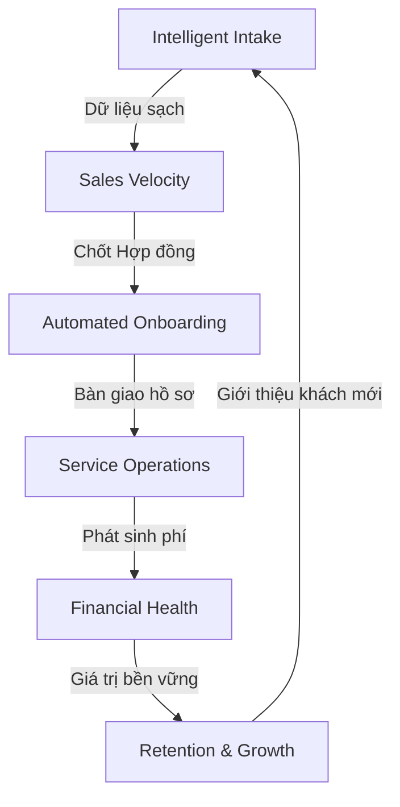

# STAX Operational Strategy & Business Philosophy
**Tầm nhìn: Xây dựng hệ điều hành thông minh cho tổ chức dịch vụ (Accounting & Legal)**

---

## 1. Bánh đà vận hành STAX (The Operational Flywheel)

Chúng ta không nhìn nhận CRM như một kho lưu trữ dữ liệu tĩnh, mà là một **Bánh đà (Flywheel)** nơi mỗi bước đi của khách hàng đều tạo ra động lực cho bước tiếp theo.

---

## 2. Các trụ cột chiến lược

### Trụ cột 1: Intelligent Intake (Cửa ngõ thông minh)
*   **Triết lý:** "Rác vào thì Rác ra". Lead phải được làm sạch ngay từ giây đầu tiên.
*   **Cơ chế:**
    *   **Omnichannel:** Tiếp nhận từ Zalo, Email, Website, Hotline.
    *   **Deduplication (Chống trùng):** Tự động đối soát SĐT/MST để nhận diện khách hàng cũ.
    *   **AI Parsing (GĐ 2):** Tự động tách thông tin từ nội dung chat Zalo hoặc ảnh chụp GPKD.

### Trụ cột 2: Sales Velocity (Tốc độ & Kỷ luật)
*   **Triết lý:** "Lead sống hay chết được quyết định trong 5 phút đầu tiên".
*   **Cơ chế:**
    *   **Activity Timeline (Omnichannel Feed):** Một dòng thời gian duy nhất hiển thị mọi tương tác (Chat, Call, Ghi chú).
    *   **Lead Scoring:** Đánh giá độ "nóng" của Lead dựa trên hành vi để Sales ưu tiên xử lý.
    *   **Auto-Recycling:** Tự động thu hồi Lead nếu Sales không tương tác sau X giờ.

### Trụ cột 3: Automated Onboarding (Bàn giao không ma sát)
*   **Triết lý:** "Thắng đơn hàng là lúc áp lực thực sự bắt đầu". Bàn giao từ Sales sang Operations (Kế toán) phải diễn ra tức thì.
*   **Cơ chế:**
    *   **Contract-to-Task:** Khi Lead chuyển sang `WON`, hệ thống tự động khởi tạo dự án và bộ Checklist công việc cho đội nghiệp vụ.
    *   **Unified Profile:** Dữ liệu từ Lead tự động chảy vào hồ sơ Doanh nghiệp (Organization), không cần nhập liệu lại.

### Trụ cột 4: Financial Health (Nhịp mạch tài chính)
*   **Triết lý:** "Kế toán không phải là đi đòi tiền, kế toán là quản trị nhịp mạch doanh nghiệp".
*   **Cơ chế:**
    *   **Automated Billing:** Tự động tạo `Finote` (Phiếu thu) hàng tháng dựa trên gói dịch vụ trong Hợp đồng.
    *   **Payment Reconciliation (Gạch nợ):** Đối soát dòng tiền thực tế (Cash Transaction) với hóa đơn (Finote) để biết ai đang nợ bao nhiêu.

---

## 3. Các bài toán nghiệp vụ cần giải quyết

| Bài toán | Giải pháp chiến lược | Trạng thái |
| :--- | :--- | :--- |
| **Thối Lead (Lead Decay)** | Hệ thống nhắc nhở và tự động chuyển Lead cho người khác. | *Đang tư duy* |
| **Quản lý tài liệu hồ sơ** | Tích hợp Google Drive tự động phân cấp thư mục theo Organization. | *Kế hoạch GĐ 2* |
| **Lợi nhuận theo kênh (ROI)** | Tracking nguồn Lead (Zalo, Ads) để tính toán chi phí trên mỗi Hợp đồng. | *Thiết kế GĐ 1* |
| **Cảnh báo rủi ro (Churn)** | Cảnh báo khi khách hàng không có tương tác hoặc nợ phí quá 2 tháng. | *Phát triển sau* |

---

## 4. Nguyên tắc kỹ thuật phục vụ nghiệp vụ (Engineering for Business)

1.  **Rich Domain Model:** Logic chốt Lead (`closeAsWon`), gạch nợ (`recordPayment`) phải nằm trong Thực thể, không để ở Service phân mảnh.
2.  **Strict Enums:** Mọi trạng thái (`status`, `stage`) phải được kiểm soát tuyệt đối bằng Enum để báo cáo Business luôn chính xác 100%.
3.  **Observability:** Mọi hành động quan trọng đều phải có Log theo `trackingId` để truy vết khi có tranh chấp nghiệp vụ.

---
*Tài liệu này được tạo ra nhằm thống nhất tư duy giữa Lãnh đạo nghiệp vụ và Kỹ thuật phát triển.*
