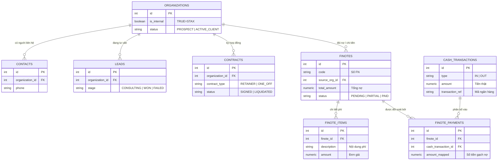
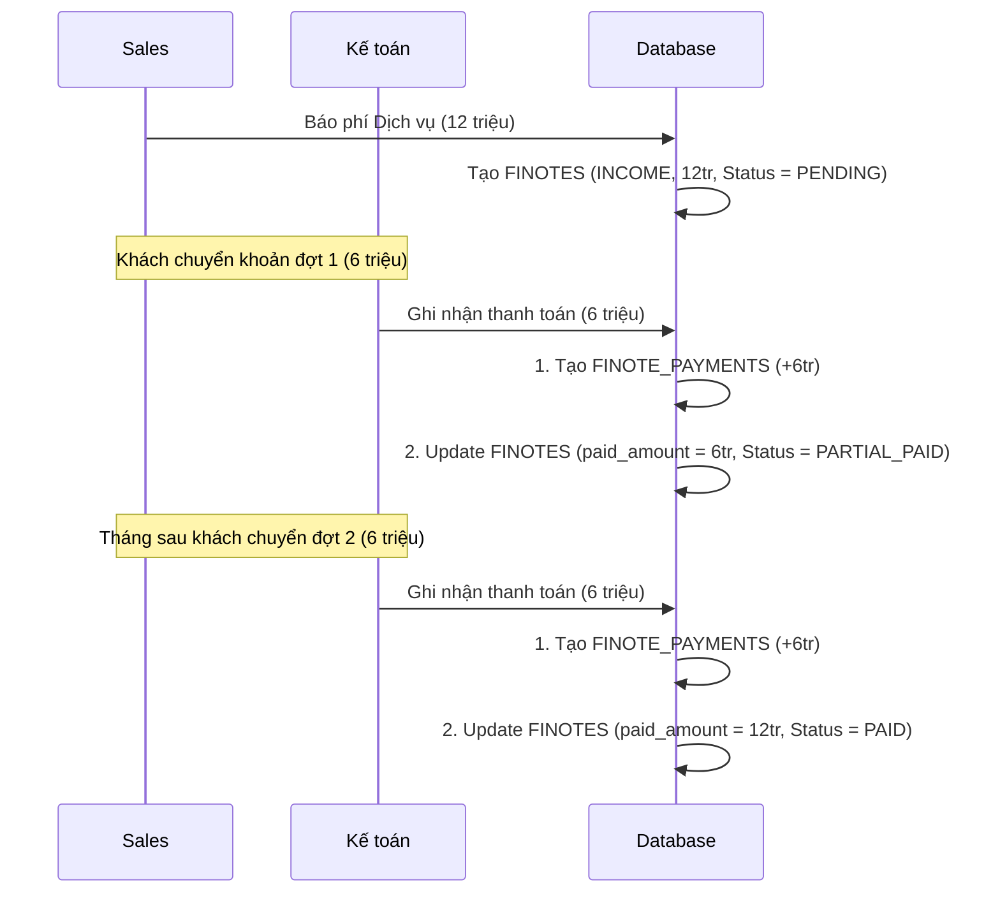

# 🏗️ TÀI LIỆU KIẾN TRÚC TỔNG THỂ HỆ THỐNG ERP/HRM/CRM (STAX ENTERPRISE)

## 1. TRIẾT LÝ THIẾT KẾ CỐT LÕI (CORE PHILOSOPHY)

Hệ thống được thiết kế dựa trên 4 trụ cột kiến trúc, đảm bảo khả năng mở rộng từ một công ty đơn lẻ (Single-tenant) lên nền tảng đa doanh nghiệp (SaaS Multi-tenant) mà không cần đập đi xây lại:

1.  **Organization-Centric (Mọi thứ xoay quanh Organization):** Bảng `Organizations` là "Mặt trời" của hệ thống. Nó đại diện cho mọi thực thể có tư cách pháp nhân. Cờ `is_internal` sẽ quyết định thực thể đó là STAX (Chủ sở hữu) hay là Khách hàng/Đối tác. Sơ đồ nhân sự (HRM) hay Hợp đồng (CRM) đều được neo vào một Organization ID.
2.  **Entity-Process Separation (Tách biệt Thực thể & Tiến trình):** 
    *   *Thực thể (Entity - DNA):* `Organizations` (Doanh nghiệp), `Contacts` (Con người). Dữ liệu này tồn tại vĩnh viễn.
    *   *Tiến trình (Process):* `Leads` (Đang tư vấn), `Contracts` (Đang phục vụ), `Finotes` (Đang nợ). 
3.  **Tách biệt Giao diện và Lõi hệ thống (Presentation vs Core):** Giao diện sử dụng thuật ngữ thân thiện với người dùng (Thu tiền, Chi tiền, Tạm ứng). Nhưng Database lõi quy về một chuẩn duy nhất (Single-Table Design) để tối ưu hóa việc thống kê dòng tiền.
4.  **Kiến trúc vĩ mô (DDD, Clean Architecture & Event-Driven):** Tách biệt hoàn toàn Business Logic khỏi Framework, giao tiếp liên module thông qua Message Queue.

---

## 2. HỆ THỐNG PHÂN TẦNG MODULE (TIER SYSTEM)
Để quản lý độ phức tạp và ranh giới trách nhiệm, hệ thống phân loại module theo 3 cấp độ:

| Cấp độ | Đặc điểm | Ví dụ Module |
| :--- | :--- | :--- |
| **Tier 1 (Foundation)** | Không có nghiệp vụ. Chỉ cung cấp hạ tầng dùng chung cho toàn hệ thống. | `Rbac`, `Notification`, `AuditLog (Nhật ký)`, `Storage` |
| **Tier 2 (Domain Core)** | Chứa các thực thể DNA và quy trình vận hành xương sống của doanh nghiệp. | `Employee`, `OrgStructure`, `Office`, `Kpi` |
| **Tier 3 (Process Flow)** | Các module quản lý dòng chảy nghiệp vụ (Flow) và tiền bạc. Phụ thuộc vào Tier 2. | `CRM (Leads)`, `Accounting (Finotes)`, `Contracts` |

### Nguyên tắc cô lập (Isolation Rules):
1.  **Tier 1** không được biết về sự tồn tại của bất kỳ module nào khác.
2.  **Tier 2** không được phụ thuộc vào Tier 3.
3.  **Cross-Module Communication:** Các module không được gọi trực tiếp Repository của nhau (trừ các trường hợp ADR đặc biệt). Giao tiếp phải thông qua:
    *   **SYNC:** Giao tiếp qua `Domain Service Port` (Interface).
    *   **ASYNC:** Giao tiếp qua `EventBus` (Message Queue).

---

## 3. HỆ THỐNG GIÁM SÁT (AUDIT LOGGING SYSTEM)
Để đảm bảo tính minh bạch và khả năng truy vết (Traceability), hệ thống triển khai cơ chế Audit Log tập trung:
*   **Mục tiêu:** Ghi lại mọi hành động thay đổi dữ liệu trọng yếu (Ai làm, Làm gì, Khi nào, Dữ liệu trước và sau).
*   **Cơ chế:** Hybrid Sync/Async. Ghi log theo nguyên tắc **Fire-and-forget** (không làm gián đoạn nghiệp vụ chính).
*   **Tích hợp:** Tích hợp trực tiếp vào các Orchestration Services tại tầng Application (Lead Won, Payment Reconciliation, RBAC Assignment).

---

## 4. NGÔN NGỮ NGHIỆP VỤ & QUY CHUẨN ĐẶT TÊN (UBIQUITOUS LANGUAGE)

Trong Domain-Driven Design (DDD), việc thống nhất ngôn ngữ giữa Đội Lập trình (Dev) và Đội Kinh doanh (Biz) là yếu tố sống còn. 

### A. Bảng Đối Trọng: Tại sao chọn tên này mà không phải tên khác?

| Thuật ngữ STAX (Operation) | Thuật ngữ Lõi Database | Góc nhìn & Vai trò Nghiệp vụ (Tại sao chọn?) |
| :--- | :--- | :--- |
| **Doanh nghiệp / Khách hàng** | `Organization` | Đại diện chung cho B2B. Client sẽ có `status` là `PROSPECT`, `ACTIVE_CLIENT` hoặc `INACTIVE_CLIENT`. |
| **Người liên hệ** | `Contact` | Người đại diện công ty hoặc khách lẻ B2C. |
| **Gói dịch vụ 1 lần (One Off)** | `contract_type = 'ONE_OFF'` | "One OFF" là *Tính chất* của dịch vụ, không phải *Trạng thái* hợp đồng. Trạng thái Hợp đồng chỉ bao gồm: Đã ký, Chờ ký, Tạm ngưng, Thanh lý. |
| **Giấy Đề Nghị / Lệnh thu tiền** | `Finote` | Đây là tờ giấy ghi nhận **CÔNG NỢ** (Yêu cầu thanh toán). Finote có Type = `INCOME` (Đòi tiền) hoặc `EXPENSE` (Xin chi tiền). Format: `FEN-<MST>-YYYYMMDD-<Seq>`. |
| **Dòng tiền / Sao kê** | `Finote Payment` | Đây là **TIỀN THẬT** (Cashflow). Khách hàng có thể trả góp nhiều lần cho 1 Finote. Bảng này lưu vết tiền vào ra chính xác lúc nào, do ai xác nhận. |

### B. Quy chuẩn Coding & Database
*   **Database Schema:** `snake_case` số nhiều (VD: `organizations`, `finote_payments`).
*   **Primary/Foreign Keys:** PK luôn là `id`. FK luôn là `tên_bảng_số_ít_id` (VD: `organization_id`).
*   **Domain Events:** `[Thực Thể][Hành Động Quá Khứ]Event` (VD: `ContractSignedEvent`, `FinotePaidEvent`).

---

## 4. SƠ ĐỒ THỰC THỂ ĐA MÔ HÌNH (OMNICHANNEL ERD)

Sơ đồ này minh họa việc tách biệt Entities, Processes và Cashflow.

---

## 5. CHIẾN LƯỢC KIẾN TRÚC MỞ RỘNG (SCALABILITY ARCHITECTURE)

1.  **Ports & Adapters (Hexagonal Architecture):**
    *   Tầng `Domain` không biết DB là gì. Việc đổi Storage chỉ cần code thêm Adapter.
2.  **Event-Driven (Sự kiện điều hướng):**
    *   Các module (CRM, Accounting, HRM) **KHÔNG import Service của nhau**. Giao tiếp qua Message Queue (RabbitMQ/Kafka).
3.  **Audit Log & Transaction Protection:**
    *   Sử dụng `DrizzleBaseRepository` kết hợp với **Async Local Storage (ALS)** để tự động quản lý Transaction và truy vết Actor thực hiện hành động.

---

## 6. CÁC LUỒNG NGHIỆP VỤ CỐT LÕI (CORE WORKFLOWS)

### Luồng 1: Chốt Sale Doanh Nghiệp (CRM Workflow)
**Mục tiêu:** Tạo pháp nhân, ký hợp đồng và bàn giao đội ngũ vận hành.

```mermaid
sequenceDiagram
    participant Sales
    participant DB as Database (Tx)
    participant Audit as AuditLog Service
    participant RMQ as RabbitMQ

    Sales->>DB: Nhập thông tin Khách hàng & Nhu cầu vào LEAD
    Sales->>DB: Nhấn [CHỐT HỢP ĐỒNG]
    rect rgb(10, 18, 25)
        Note right of DB: Bắt đầu Transaction
        DB->>DB: 1. Update Lead (Stage = WON)
        DB->>DB: 2. Update Organization (Status = ACTIVE_CLIENT)
        DB->>DB: 3. Insert Contract
        DB->>DB: 4. Insert Service_Assignments
        DB->>Audit: 5. Ghi log hành động [LEAD.CLOSE_WON]
        Note right of DB: Commit Transaction
    end
    DB->>RMQ: Publish: [ClientOnboardedEvent]
```

### Luồng 2: Quản lý Công nợ & Dòng tiền (Follow Cash Workflow)
**Mục tiêu:** Phân tách rõ ràng giữa Việc tạo giấy đòi tiền và Tiền thực tế vào tài khoản. Cho phép thanh toán trả góp nhiều đợt.

---

## 7. LỘ TRÌNH THỰC THI (ROADMAP)

### Phase 1: Core Foundation & Hardening (Đã hoàn thành 100%) 🚀
- [x] **Clean Architecture Refactor:** Chuyển đổi CRM & Accounting sang kiến trúc 4 lớp.
- [x] **Intelligent Intake:** Hệ thống tiếp nhận Lead thông minh với khả năng chống trùng (Deduplication).
- [x] **Strict Enum Hardening:** (ADR 002) Gia cố toàn bộ trạng thái hệ thống bằng Enum cứng tại DB và Domain.
- [x] **Audit Log System:** (ADR 004) Kiến trúc nhật ký hành động toàn diện cho 4 luồng chính (Lead, Payment, RBAC, User).
- [x] **Legacy Data Migration:** (ADR 003) Di cư toàn bộ dữ liệu CRM legacy (Clients, Leads, Contracts, Finotes) vào hệ thống mới. **363 Finotes + 158 Contracts + 1,172 Leads + 202 Orgs đã vào thành công.**
- [x] **Unit Testing:** Đảm bảo coverage cho các service lõi (Lead Intake, Payment Reconciliation, AuditLog).

### Phase 2: Operational Intelligence (Tư duy Bánh đà - Đang thực hiện)
- [/] **Omnichannel Activity Feed:** 🏗️ Xây dựng dòng thời gian tương tác dựa trên hệ thống Audit Log vừa triển khai.
- [ ] **Unified Onboarding:** Tự động hóa việc bàn giao hồ sơ từ Sales sang Operations (Contract -> Task Checklist).
- [ ] **AI-Powered Parsing:** Tự động đọc nội dung chat Zalo/Email và điền vào form Intake.

### Phase 3: Financial Ops & Strategic Reporting
- [ ] **Automated Billing:** Tự động tạo Finote hàng tháng dựa trên biểu phí hợp đồng.
- [ ] **Master Dashboard:** Báo cáo tỷ lệ chuyển đổi (Conversion Rate) và dòng tiền thực (Cashflow ROI).

---

## 8. HỒ SƠ QUYẾT ĐỊNH KIẾN TRÚC (ADR)

### ADR 001: Export Repository trực tiếp từ CRM Module
*   **Quyết định:** Export `IOrganizationRepository` và `IContactRepository`.
*   **Lý do:** Bảng `Organizations` là "Cột sống" dữ liệu chung. Các module Kế toán, HRM cần truy cập trực tiếp thông tin định danh khách hàng mà không cần qua tầng Service trung gian.

### ADR 002: Triển khai Strict Enum (Gia cố kiểu dữ liệu)
*   **Quyết định:** Thay thế toàn bộ trường `text` status/type bằng `pgEnum` (Drizzle) và TypeScript Enums.
*   **Lý do:** Đảm bảo báo cáo kinh doanh và tài chính chính xác tuyệt đối. Loại bỏ lỗi " Won" (có dấu cách) hoặc "won" (chữ thường) gây sai lệch dữ liệu.
*   **Áp dụng:** Organization, Lead, Contract, Finote.

### ADR 003: Hybrid Storage Pattern (JSONB cho dữ liệu legacy không chuẩn)
*   **Quyết định:** Thêm cột `metadata JSONB` vào các bảng `organizations`, `contacts`, `leads`, `contracts` để lưu dữ liệu legacy không có cột tương ứng trong schema quan hệ.
*   **Lý do:** File CSV/Excel legacy của STAX chứa hàng chục trường "greedy" (Nick name, Ghi chú nội bộ, Thời hạn tạm ngưng...) không phù hợp mô hình quan hệ nhưng không thể bỏ. Thêm cột thật vào schema sẽ gây bloat và vi phạm Single Responsibility. JSONB cho phép preserve 100% dữ liệu lịch sử và query linh hoạt khi cần.
*   **Áp dụng:** Organizations, Contacts, Leads, Contracts (26/04/2026).

### ADR 004: Kiến trúc Audit Log Tập trung (Tier 1 Foundation)
*   **Quyết định:** Xây dựng `AUDIT_LOG_PORT` và `DrizzleAuditLogService` tại Tier 1.
*   **Lý do:** Đảm bảo tính nhất quán (Consistency) trong việc giám sát hành động người dùng. Tránh việc mỗi module tự viết log theo cách riêng.
*   **Thiết kế:** Sử dụng schema tập trung `audit_logs` với JSONB `before/after` để lưu vết thay đổi dữ liệu chi tiết.

### ADR 005: Fire-and-forget Logging Pattern
*   **Quyết định:** Việc ghi log không được phép làm lỗi luồng nghiệp vụ chính. 
*   **Cơ chế:** Sử dụng try-catch bao bọc lệnh ghi log. Nếu DB ghi log bị lỗi (đầy disk, lock...), hệ thống vẫn phải cho phép hoàn tất giao dịch tài chính/nghiệp vụ. Audit Log là "Support System", không phải "Hard Constraint".

---
*Tài liệu được cập nhật ngày 26/04/2026 bởi Antigravity AI.*
